注：为个人学习总结需要，如有侵权，请您指出。[持续更新， 如有错误，请您指出]        

> 邮箱：*<u>yangqiokay@foxmai.com</u>*      微信号：<u>*18810578662*</u>

​    

## **「Fight！秋招」**

------

### A.关于「Fight！秋招」「技能&专业书」：2／num

### **[2.统计学习方法]()**

| 三次总结&忌盲目乐观 | 二次总结&能讲出来           | 背诵条目&一次总结                                | 参考理解                                     |
| ---------- | ------------------- | ---------------------------------------- | ---------------------------------------- |
|            | **第一章开始：统计学习方法概述**  |                                          |                                          |
|            |                     | ***1.统计学习定义***：基于数据构建统计模型，并对数据进行预测分析 ***2.统计学习方法分类：***监督／非监督／半监督／强化学习***3.统计学习三要素：***模型／策略／算法***4.统计学习实现步骤***：训练数据-假设空间-学习策略-学习算法-选择最优模型-预测分析 | ---  ------ |
|            |                     | **1.监督学习问题分类：**输入输出连续：回归；输出离散：分类；输入输出为序列：标注 **2.监督学习假设：**XY联合概率分布。**3监督学习目的：**输入输出映射 **4 监督学习模型**：概率模型／非概率模型。**5.1监督学习学习过程**：学习系统利用D学习模型（输入输出的映射） **5.2监督学习预测过程**：预测系统输入x,由模型给出输出。 | ---------  |
|            |                     | **1.统计学习第二要素策略**：选择最优模型：损失函数(常用01/平方／绝对值／对数)越小，模型越好； 期望损失／风险函数越小的模型；经验风险／经验损失逼近，越小，模型越好；为避免过拟合：结构风险最小化，模型越好**2.监督学习问题转化**：经验风险／结构风险的最优化问题，经验／结构函数是最优化的目标函数 | ---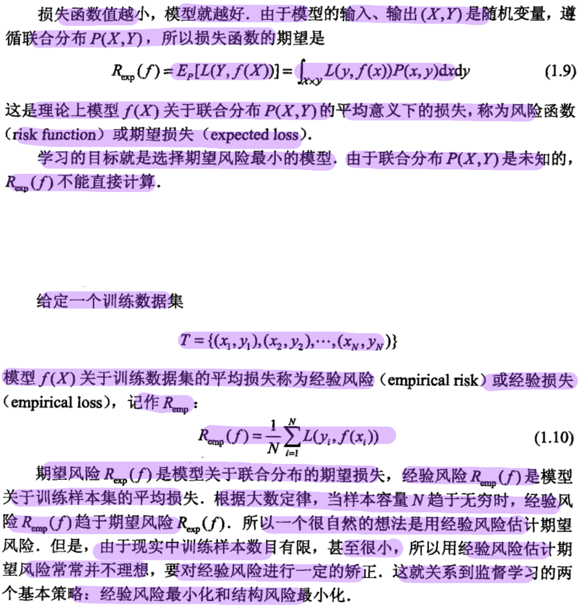------ |
|            |                     | **1.模型选择：**训练误差／测试误差／复杂度关系，过拟合产生。最优模型选择以达到测试误差最小。**2方法一正则化：**结构风险最小化策略的实现：复杂度递增函数：L1/L2范数 ：奥卡姆剃刀原理。 **3方法二交叉验证：**(数据集大。)随机切分三部分。否则交叉验证：重复使用数据：**3.1简单交叉：**随机分2部分：不同条件训练模型，择优 **3.2S折交叉：**随机S个子集。可重复S次。**3.3留一交叉验证**S = N | --- 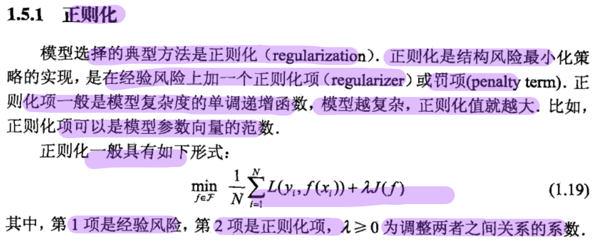--- 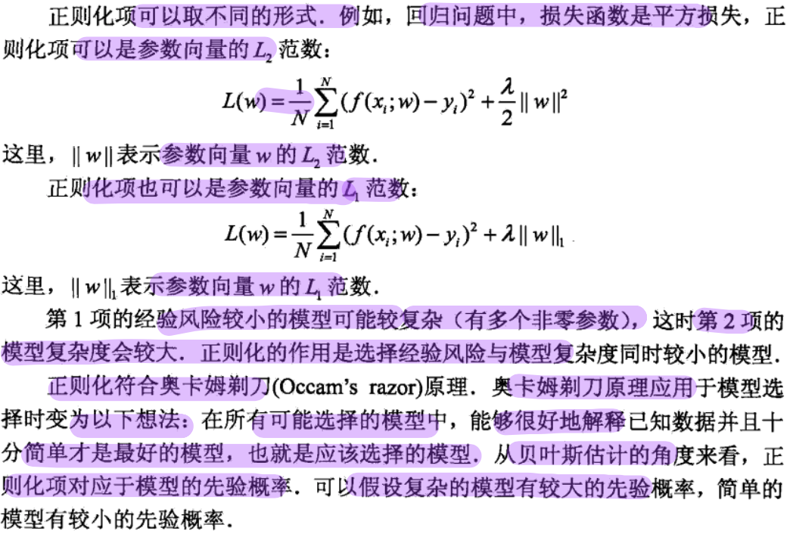---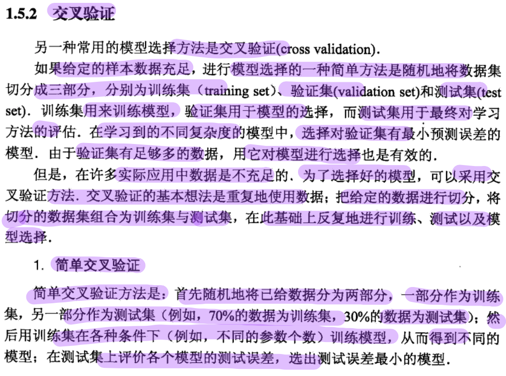--- |
|            |                     | **1.泛化能力：**对未知数据的预测能力；通过泛化误差／期望风险反映      | 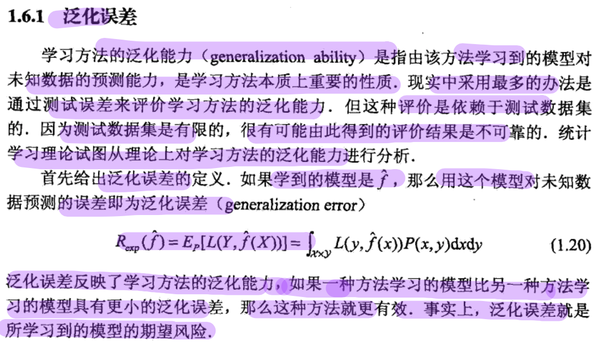                   |
|            |                     | **1.监督学习任务：**决策函数／条件概率分布 **2.生成模型：**先学习联合概率分布，再求条件概率模型。因为模型表示了输入X产生Y输出的生成关系**3判别模型：**直接决策函数／条件概率分布。关心对输入X应该预测什么Y |  |
|            |                     | **1.分类问题：**输出离散值； 分类决策函数P(Y\|X)或Y= f(X)：分类器；对新输入x分类预测其输出类y。**2 评价指标：**分类准确率**A**：正确分分类数与总样本比值／精确率**P**：预测为正类，原来就是正类的占比／召回率**R**：原来是正类，预测为正类的占比／**F1**。**3分类应用：**银行客户分类／网络安全日志非法入侵检测／图像人脸识别／手写数字是识别／网页分类／文本分类：文本特征频率。 | ------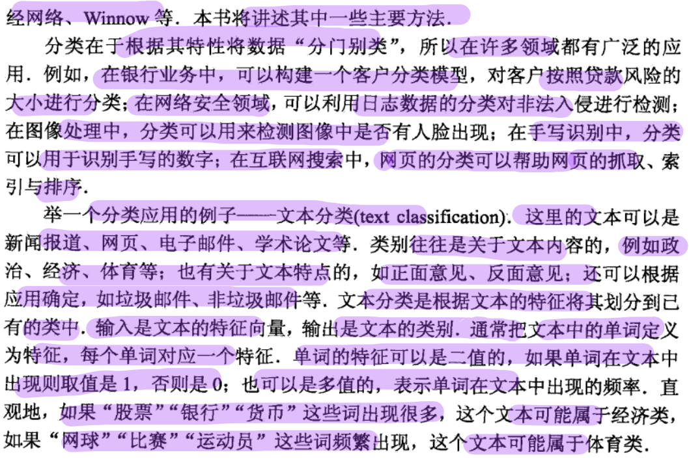--- |
|            |                     | **1.标注tagging问题：**分类的推广：输入观测序列，输出标记序列／状态序列。 学习系统：模型为条件概率分布。输出使得条件概率最大的序列标记序列y。**2.标注应用：**信息抽取／词性标注 | 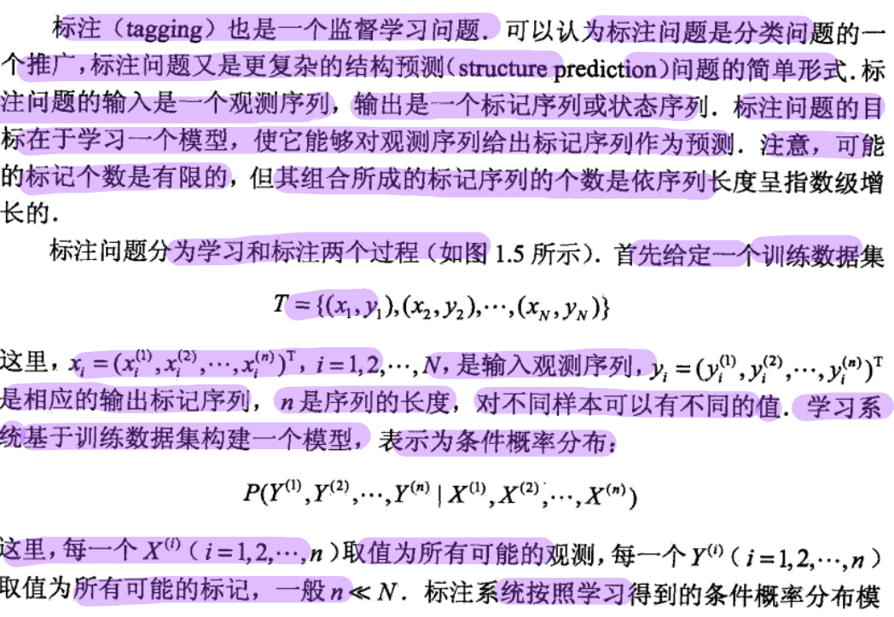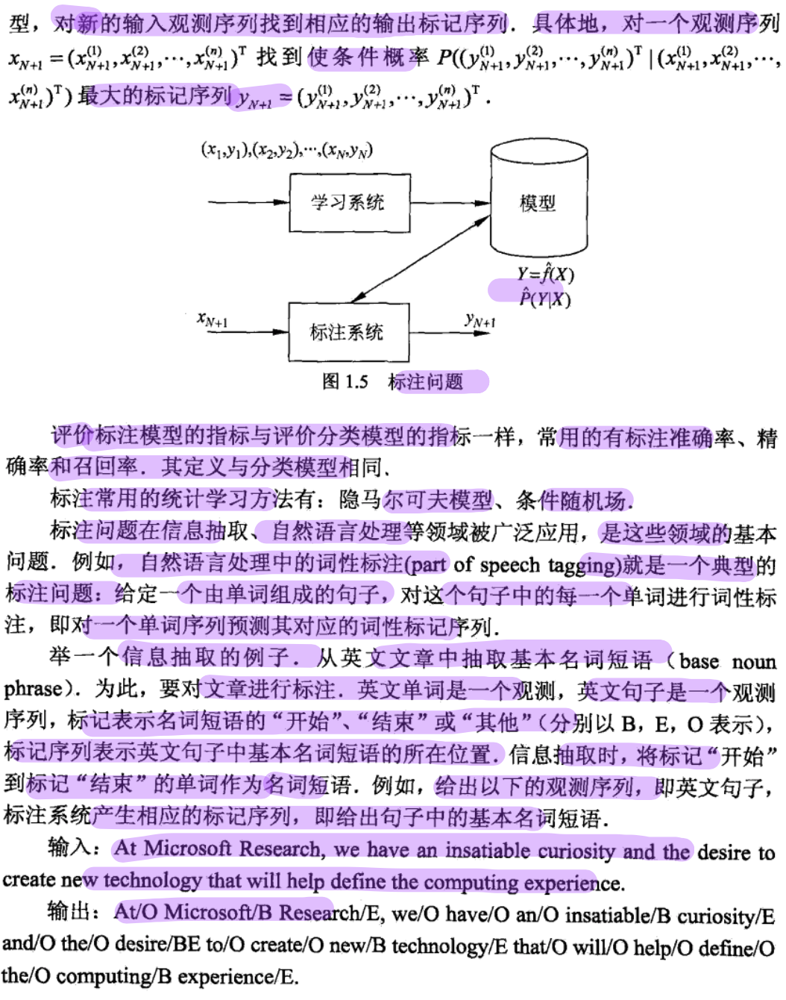 |
|            |                     | **1.回归问题：**表述输入到输出映射的函数模型，等价于函数拟合。分为一元回归／多元回归；分为线性回归／非线性回归；  回归常用损失函数：平方损失函数-最小二乘法。 **2.回归应用：**商务市场趋势预测、产品质量管理、客户满意度调查、投资风险分析、股票预测 |   |
|            | **第一章总结**           |                                          | 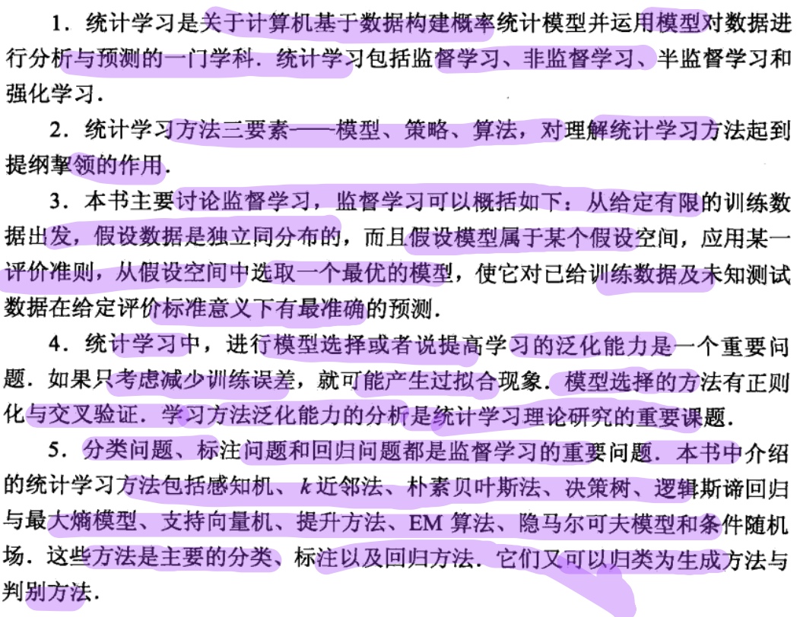                   |
|            | **第二章开始：感知机**       |                                          |                                          |
|            |                     | **1.感知机：**二分类的线性分类模型；对应化分正负的分离超平面；判别模型；导入损失函数，梯度下降得到感知机模型；NN/SVM的基础； **2感知机模型：**输入x,输出+1/-1；函数f(x)为感知机。 |  |
|            |                     | **1.感知机学习策略：**假设线性可分，感知机目标学习分离超平面，即确定w/b。定义经验损失函数，并极小化  **2损失函数选择：**误分类点到超平面S的总距离：经验风险函数。 |  |
|            |                     | **1.感知机学习算法**：求策略中损失函数的最优化问题：梯度下降。  **2感知机学习算法原始形式：**minL(w,b),梯度下降更新w/b。算法步骤4步：**2.1**初始w/b-**2.2**训练集选择数据-**2.3**更新w/b-**2.4**再选择数据，直到没有误分类点.   **3感知机例子：** |  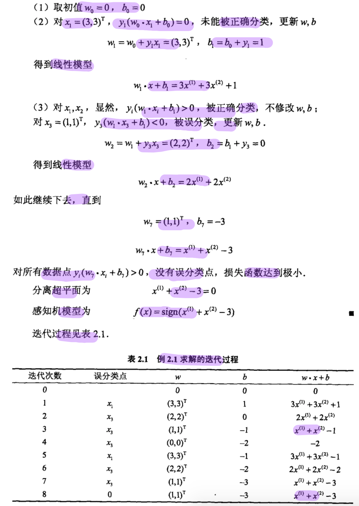 |
|            |                     | 1.**感知机收敛**：存在多解，依赖初值，需要约束条件才能唯一，也就是线性支持向量机； 感知机线性不可分则不收敛。  2.**感知机学习算法对偶形式：**将w/b表示为x和y的线性组合，通过系数得到w/b。 算法步骤4步：**2.1**a = 0,b = 0 **2.2**训练集选数据 **2.3**更新a/b **2.4**直到没有误分类数据。  **3对偶形式例子** |   |
|            | **第二章总结**           |                                          | 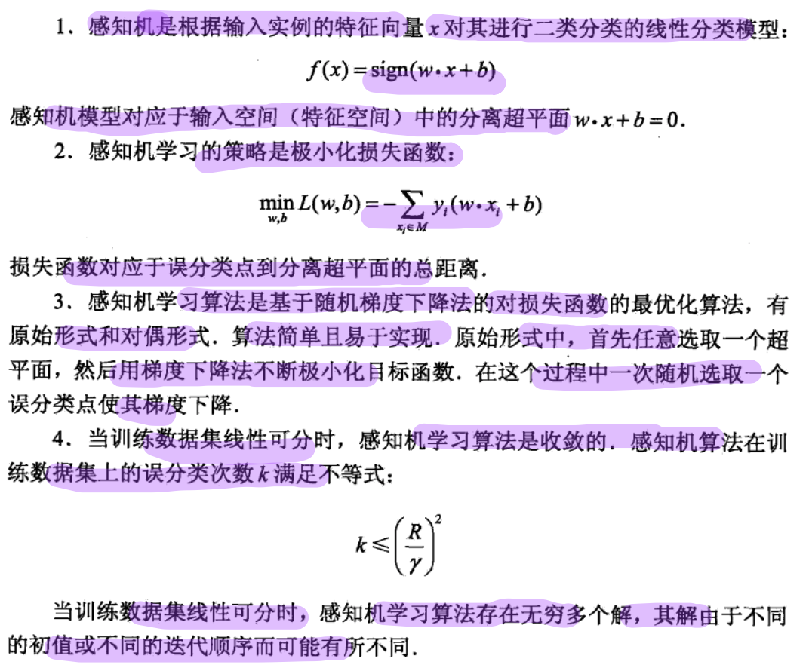                   |
|            | **第三张开始：K近邻算法**     |                                          |                                          |
|            |                     | **1.K近邻(K-nearest neighbor k-NN)：**基本分类回归法。分类时，对新实例，根据其k个最近邻的训练实例的类别，多数表决来进行预测。不具有显式学习过程。 实际上利用训练数据进行特征空间划分作为分类模型； **三要素：**k值选择、距离度量、分类决策规则。 **2.k近邻算法：**2步：**2.1**根据给定距离度量，在训练集T中找出与x最邻近的k个点，涵盖这k个点的邻域为Nk(x) **2.2**在Nk(x)中根据分类决策规则(所属表决)决定y。当k = 1:最近邻算法。**3K近邻模型：**特征空间的划分。**3.1要素一：距离度量：**Lp距离确定 。**3.2要素二：k值选择：**较小k,较小邻域，近似误差减小，估计误差增加，模型复杂，易过拟合。k较大相反。一般先取比较小值，交叉验证择优k。**3.3要素三：分类决策规则**：多数表决；如果分类损失函数0/1 则误分类概率P,则误分类率为；要是其最小即经验风险最小。 | 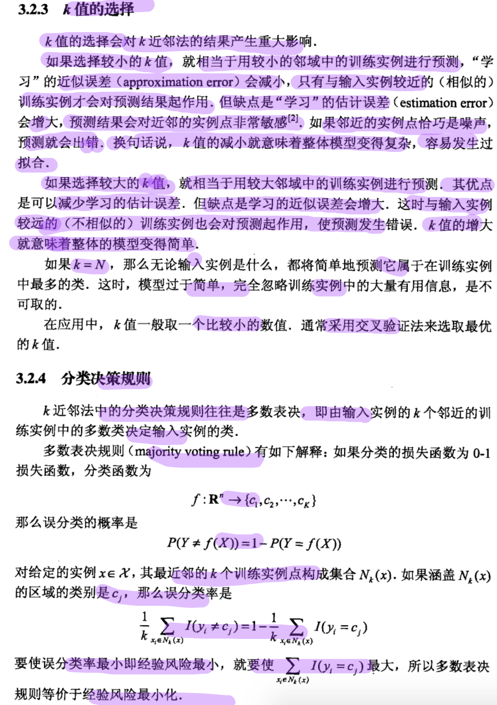 |
|            |                     | **1.k近邻实现：kd树：**实现主要是如何对训练数据快速k近邻搜索。**2.构造kd树：** 对k维空间的实例点存储检索的树形数据结构、二叉树；k维空间的划分 构造算法3步：**2.1**:构造根节点，对应于包含T的k维空间超矩形区域：选择中位数切分，左右子节点划分 **2.2**重复，中位数切分 **2.3**直到两个空间没有实例点。停止，形成区域划分 **3例子**   **4.搜索kd树**：可知利用kd树可以减少大部分点的搜索，减少搜索计算量，搜索最近邻算法 共4步：**4.1**在kd树中找到包含目标点的叶节点：方法：从根节点递归向下访问kd树，如果当前维坐标小于切分点坐标，移动左子节点，否则，直到子节点为叶节点 **4.2**此叶节点为“当前最近点” **4.3**递归往上退。每个节点如下操作：**4.3.1**:如果更近，则为当前最近点**4.3.2**当前最近在一个子节点区域，检查父节点另一子节点区域是否更近的点，球的相交，不相交接着向上，相交，移动到另一子节点。**4.4**回到根节点，搜索结束当前最近点即x最近邻。平均复杂**O(logN)** **5.例子** |  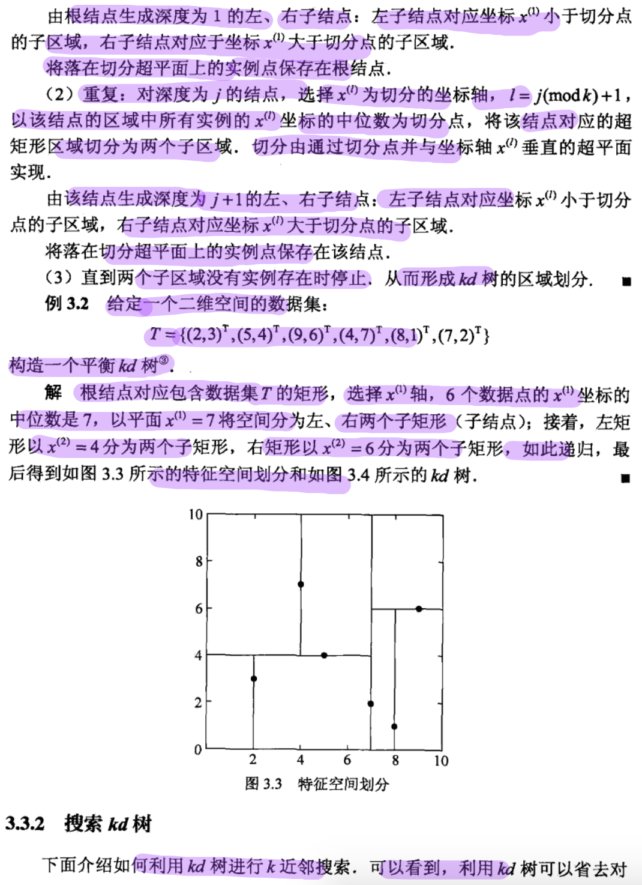 |
|            | **第三章总结**           |                                          | 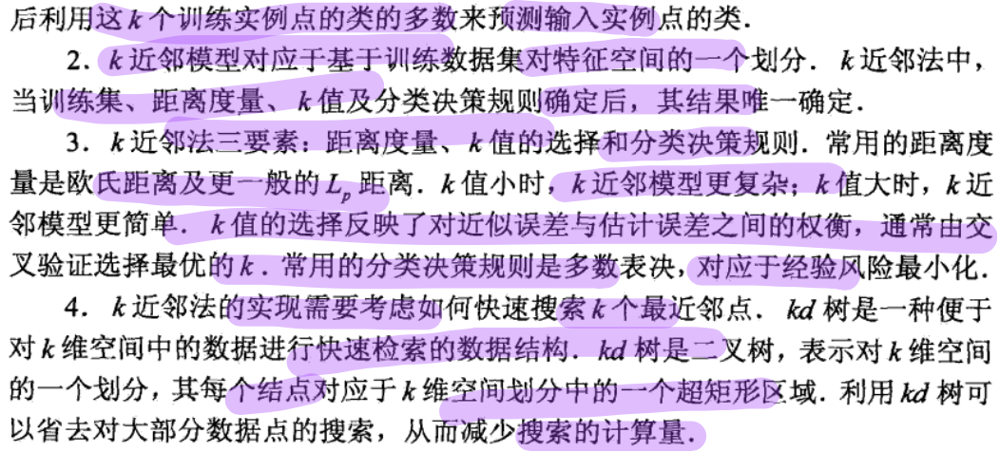 |
|            | **第四章开始：朴素贝叶斯**     |                                          |                                          |
|            |                     | **1.朴素贝叶斯法：**基于贝叶斯定理与特征条件独立假设的分类算法。对数据集，基于特征独立假设，学习输入／输出的联合概率分布，基于此模型，对给定x,利用贝叶斯定理求**后验概率**最大输出y。**2.基本方法：**先验概率分布P(y=c) 条件概率分布(**朴素贝叶斯做了条件独立性假设**)P(X=x\|y=c):得到联合概率分布P(x,y)。属于生成模型； 分类时，对给定输入x,通过学习到的模型根据贝叶斯计算后验概率分布P(Y=c\|X=x) **3.后验概率最大化：**朴素贝叶斯将实例分到后验概率**最大**的类中。等价于期望风险**最小**化。 | 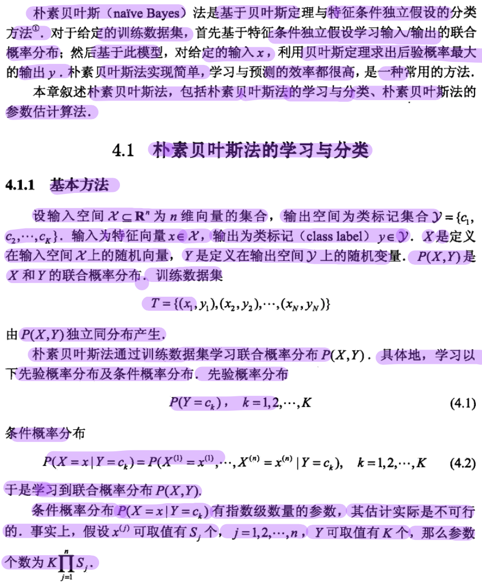 |
|            |                     | **1.朴素贝叶斯参数估计：1.1极大似然估计：** 朴素贝叶斯中学习意味着P(Y=c)和P(X=x\|Y=c).可用极大似然估计法去估计相应概率。  先验概率P(Y=c)的极大似然估计P;条件概率的极大似然估计P;  **1.2学习分类算法：** 朴素贝叶斯算法：3步：**1.2.1**:计算先验概率及条件概率 **1.2.2**计算后验概率 **1.2.3**确定实例x的类 **1.3例题**  **1.4贝叶斯估计：** 用极大似然估计可能出现估计概率值为0，采用拉普拉斯平滑。**1.5例题** |  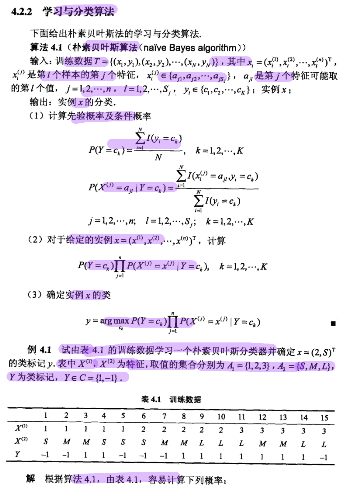 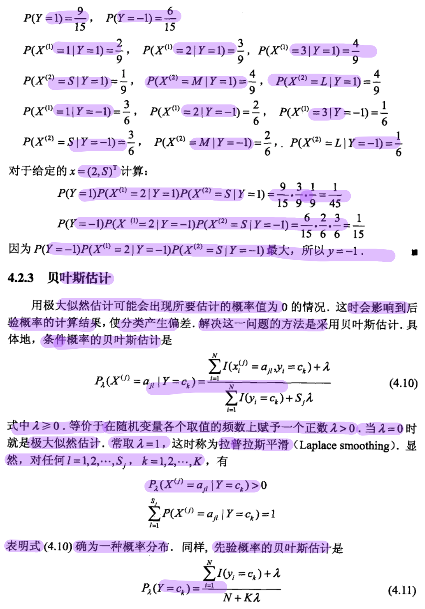 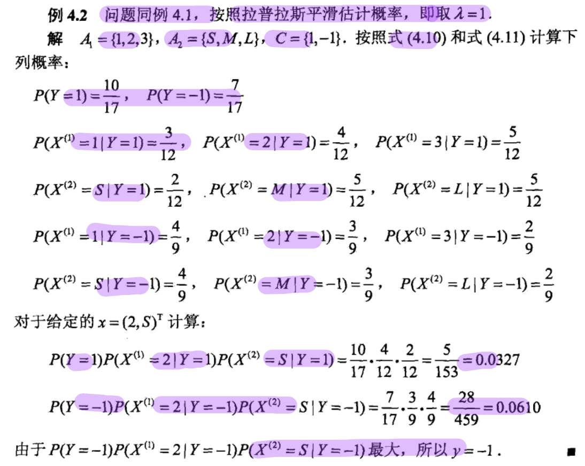 |
|            | **第四章总结**           |                                          |  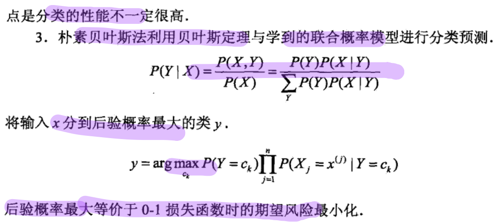 |
|            | **第五章开始：决策树**       | **1.决策树：**基本分类回归方法；树形结构；if-then规则的集合(**互斥且完备**)／特征空间与类空间的条件概率分布(**P(Y\|X)**)；根据损失函数最小化原则建立决策树模型；包括**三步骤**：特征选择、决策树生成、决策树剪枝； 由节点和边都成。**2.决策树学习用损失函数的目标最小化：**通常是正则化极大似然函数。递归的选择最优特征。进行分割。**3.决策树剪枝：**避免过拟合，使具有更好泛化能力。 | 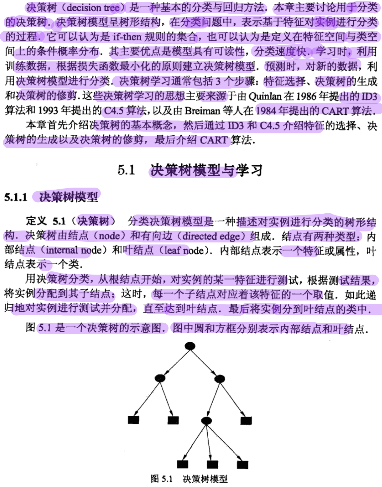   |
|            |                     | **1.特征选择：**选取对训练数据具有分类能力的特征，提高决策树学习的效率；通常准则：信息增益／信息增益比。 **2信息增益：** **熵**：随机变量不确定性的度量H(p) 。**条件熵**H(Y\|X)表示在已知随机变量X的条件下随机变量Y的不确定性。**信息增益**g(D,A)-H(D)-H(D\|A)[**互信息**]：得知特征X的信息使得类Y的信息不确定性减少的程度。**信息增益算法**3步：**2.1**计算数据集的经验熵 **2.2**计算特征A对数据集D的经验条件熵H(D\|A) **2.3**计算信息增益 ：**例子**: **3信息增益比**：信息增益相对于训练数据集而言，没有绝对意义。当H(D)偏大，信息增益会偏大。用信息增益比可以矫正：g(D,A) = g(D,A)/H(D) |    |
|            |                     | **1.决策树生成：ID3算法：**在各个节点用信息增益选择特征，递归构建决策树。算法6步：**1.1**若都属于同一类，T为单节点树 **1.2**若特征集为空，则单节点树。并最大类作为类标记 **1.3** 否则，计算信息增益，选择最大特征A **1.4**如果A小于阈值eta,T为单节点。实力最大类作为节点类标记。**1.5**否则，按照A分割D，**1.6**递归调用1-5。 2. **C4.5生成：用信息增益比**。算法同 | 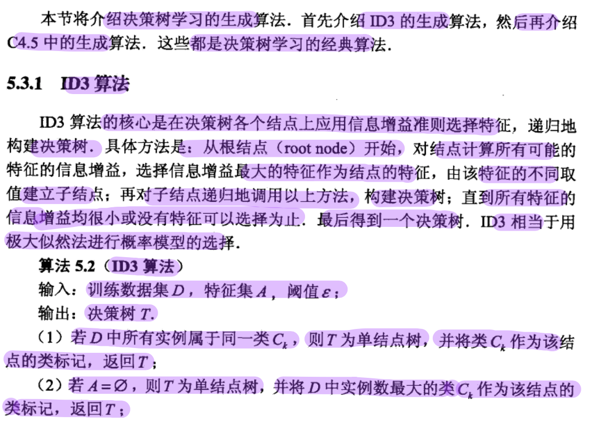   |
|            |                     | **1.决策树剪枝：**决策树生成会过拟合，复杂。需要简化：剪枝(pruning); 剪枝通过极小化决策树整体损失函数来实现：决策树学习的损失函数定义C，a控制模型拟合与模型复杂度之间的影响。较大a选择简单模型。剪枝就是a确定时，选择损失函数最小的模型；当a确定，树越大，拟合越好，复杂度越高。  可知决策树生成是局部的提高信息增益比。决策树剪枝是通过优化损失函数，减小模型复杂度的整体考虑。 损失函数极小等价于正则化的极大似然估计的模型选择。**剪枝算法3步**：**1.1**计算每个节点经验熵 **1.2** 递归往回缩，如果缩回去之后，损失函数变小了，就剪枝。父节点变为新叶节点。**1.3**返回2直到不能继续得到损失函数最小的树 |   |
|            |                     | **1.分类与回归(classification and regression tree CART): CART生成：** 回归树：平方误差最小准则。分类时：基尼指数最小化准则进行特征选择 。**1.1回归树生成：** 一个回归树对应输入空间的划分及划分单元的输出值。假设将输入空间划分为M个单元，并且每个单元有固定输出值，回归树模型f(x)。用平方误差最小准则求每个单元的最优输出。 输入空间划分：选择变量切分，寻找最优切分点。依次重复。**最小二乘回归树生成算法：** 分4步：**1.1.1**：选择最优切分变量与切分点似的最优。**1.1.2**:选定的对划分区域并绝对相应的输出值。**1.1.3**:步骤1、2重复。**1.1.4**划分成M个区域。生成决策树。**1.2 分类树的生成**：用基尼系数选择最优特征，同时决定该特征的最优二值切分点。 **1.3CART生成算法**：共4步：**1.3.1**:计算现有特征基尼系数 **1.3.2**选择基尼系数最小的特征及切分线作为最优特征及切分 **1.3.3**递归12 **1.3.4**生成CART决策树 **1.4例子**  **1.5CART剪枝：** 由2步组成：首先从生成算法的决策树底端剪枝，直到根节点，形成子树序列；然后交叉验证集测试，选择最优子树。 **1.5.1剪枝形成子树序列：**损失函数C；固定a一定有C最小的树。a较大最优子树Ta偏小;可以递归的对树进行剪枝，将a从小到大。得到n个最优子树序列。 **具体的：**从T0整体树开始剪枝，对任意节点t的损失函数C.以t为根节点的损失函数Ct；在某一a,C=Ct.而t的节点少，则进行剪枝。则对T0每一个t都计算g(t)，减去，得到子树。    **1.5.1在剪枝得到的子树序列中交叉验证选择最优子树：**用平方误差货基尼指数最小判定。 **1.6CART剪枝算法：**7步：1.6.1k=0,T=T0 1.6.2设a=+00 1.6.3自下而上对个节点计算C及g(t) 1.6.4自上而下访问内部节点，如果gt=a则剪枝，并多数表决决定类。1.6.5a=a1.6.6交叉验证得到最优子树 |   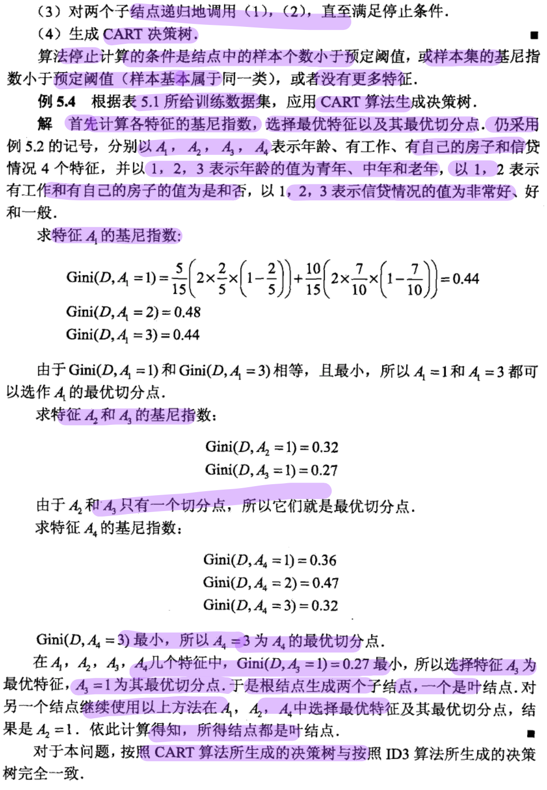 |
|            | **第五章总结**           |                                          |  |
|            | **第六章开始逻辑回归与最大熵模型** |                                          |                                          |
|            |                     | **1.逻辑回归**：分类方法 ；**最大熵**：概率模型学习准则，推广到分类问题得到最大熵模型。 都是对数线性模型。  **2.逻辑斯特分布：**分布函数属于逻辑斯特函数／密度函数 **3.二项逻辑斯特回归模型：**分类模型；条件概率分布P(Y\|X)表示。对给定x求得P(Y=1\|X) 和P(Y=0\|X)，比较两个条件概率的大小，将实例x分到概率值较大的那一类。  **4.模型参数估计：** 对训练集T,用极大似然估计估计模型参数；设P(Y=1\|X) 和P(Y=0\|X)似然函数为：**相乘**(联合概率最大，又相互独立)，对数似然，求极大值，得到w的估计值；问题转为**对数似然函数的目标函数的最优化：**梯度下降／拟牛顿法。**5.多项逻辑回归：** 二项为二分类，多项为多分类。 |   |
|            |                     |                                          | 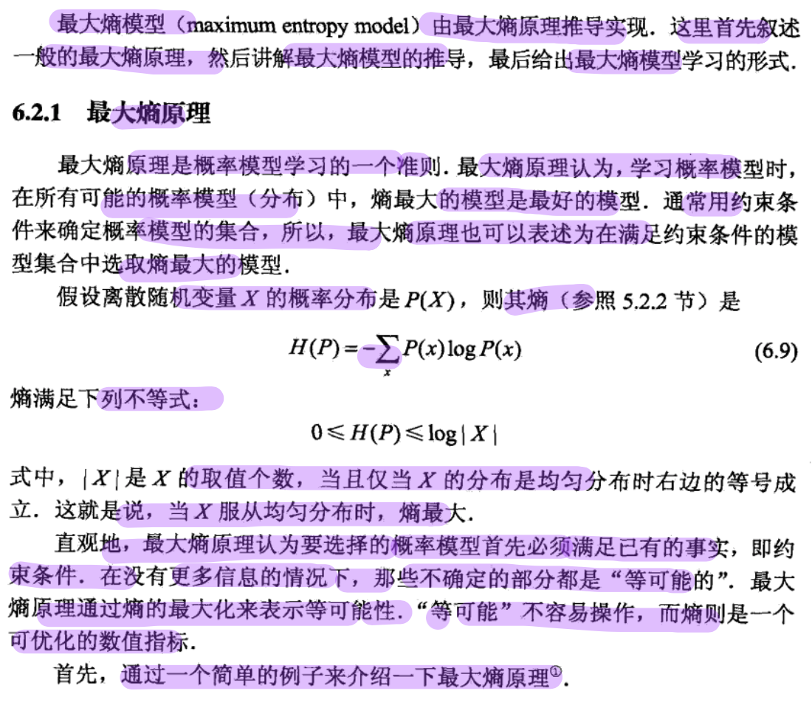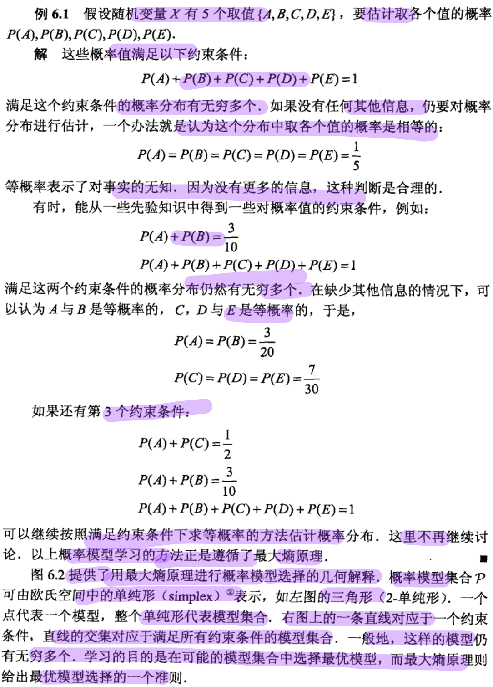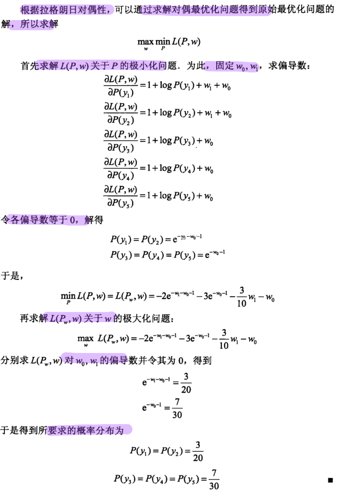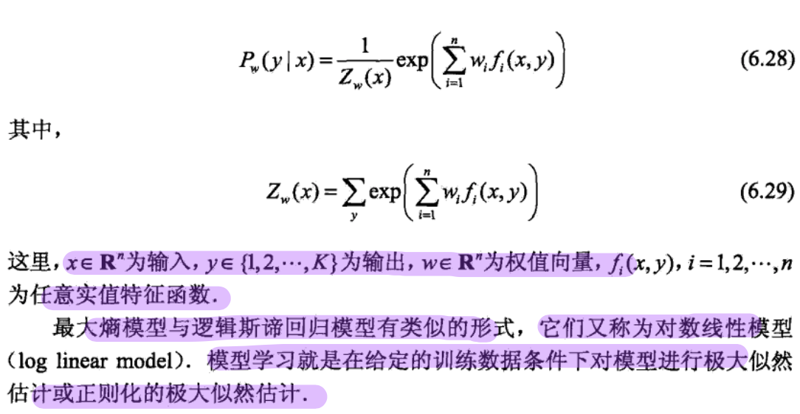 |
|            |                     |                                          |                                          |
|            |                     |                                          |                                          |
|            |                     |                                          |                                          |
|            |                     |                                          |                                          |
|            |                     |                                          |                                          |
|            |                     |                                          |                                          |
|            |                     |                                          |                                          |
|            |                     |                                          |                                          |
|            |                     |                                          |                                          |
|            |                     |                                          |                                          |
|            |                     |                                          |                                          |
|            |                     |                                          |                                          |
|            |                     |                                          |                                          |
|            |                     |                                          |                                          |