注：为个人学习总结需要，如有侵权，请您指出。[持续更新， 如有错误，请您指出]        

> 邮箱：*<u>yangqiokay@foxmai.com</u>*      微信号：<u>*18810578662*</u>

​    

## **「Fight！秋招」**

------

### A.关于「Fight！秋招」「技能&专业书」：2／num

### **[2.《统计学习方法》](http://chuansong.me/n/1895437651113)**

| 三次总结&忌盲目乐观 | 二次总结&能讲出来 | 背诵条目&一次总结                                | 参考理解                                     |
| ---------- | --------- | ---------------------------------------- | ---------------------------------------- |
|            |           | 1.统计学习：基于数据建立概率统计模型，并用模型对数据进行预测分析     2. 统计学习目的：数据预测分析，特别是未知数据预测分析    3. 统计学习方法：监督／半监督／非监督／强化。   4.统计学习方法三要素：模型／策略／算法。  5实现统计学习算法步骤：5.1得到训练数据5.2确定可能模型集合5.3确定模型选择准则(学习策略)5.4实现求解最优模型算法(学习算法)5.5通过学习方法选择最优模型5.6利用最优模型对新数据预测分析 | 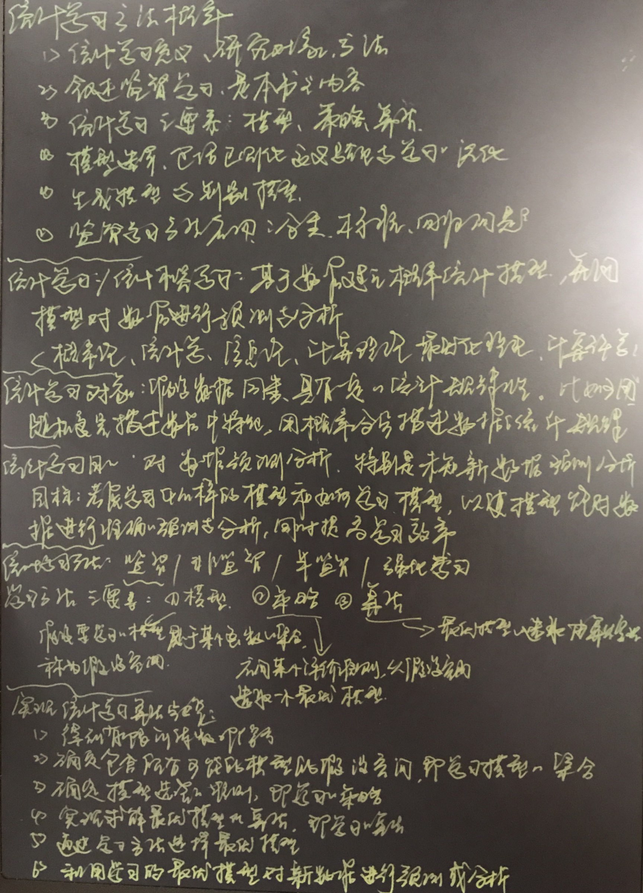 |
|            |           | 1.监督学习：从训练数据学习<u>模型</u>，对测试数据预测。  2.训练数据由<u>输入(特征向量)与输出对</u>[样本]组成。   3.问题分类：3.1输入输出连续变量：回归。3.2输出离散：分类。3.3输入输出变量序列：标注。   4.监督学习对数据的基本假设：P(X, Y)的联合概率分布存在。   5.监督学习：学习和预测两个过程。    6.监督学习模型：条件概率模型P(Y\|X) 或决策函数Y = f(X) | 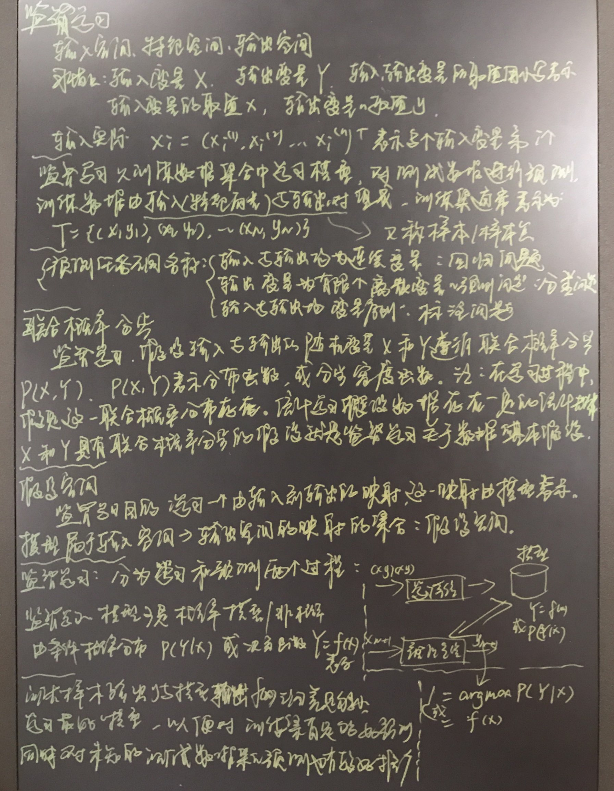 |
|            |           | 1.统计学习方法=模型+策略+算法。   2. 模型：所要学习的条件概率／决策函数。  3.策略：损失函数／风险函数。3.1损失函数：0/1、平方、绝对值、对数／对数似然。越小表示模型越好。3.2风险函数：损失函数的期望：度量平均意义下模型好坏。  4.算法：基于训练数据，根据学习策略，则统计学习问题归结为最优化问题，学习算法成为求解最优化问题的算法。 |  |
|            |           | 1.模型评估：学习方法对未知数据的预测能力：泛化能力。   2.模型选择目的：避免过拟合并提高模型预测能力。要选择复杂度适当的模型，达到使测试误差最小。    3.两种常用模型选择方法：正则化(regularization)/交叉验证。3.1正则化：结构风险最小化：是在经验风险加上正则项／惩罚项(penalty)。正则化项是模型复杂度单调增函数。L2泛数lamda/2*\|w\|^2。L1泛数lamda\|w\|。正则化用做选择经验风险与模型复杂度同时最小的模型。符合奥卡姆剃刀原理。      3.2  交叉验证：训练／<u>验证</u>[模型选择]／<u>测试</u>[最终学习方法的评估]-如果数据量大才分这3块。3.2.1简单交叉：70% 30%。3.2.2 S折交叉(S-fold)随机切S个不交叉大小相同子集：用S-1个训练，剩下测试，可重复选择最小的。3.2.3 留一交叉：S=N(leave one out) |  |
|            |           | 1.泛化能力：未知数据的预测能力。通过测试误差评价学习方法的泛化能力。2.泛化误差：学习模型的期望风险。   3.监督学习方法：生成方法(generative approach)、判别方法(discriminative approach) 分别是生成模型和判别模型。   4.生成方法：由数据学习联合概率分布P(X,Y),然后求出条件概率P(Y\|X)作为预测的模型，即生成模型P(Y\|X) = P(X, Y)/P(X)。生成模型：因为模型表示了给定输入X产生Y的生成关系。典型生成模型：朴素贝叶斯／隐马尔可夫模型。   5.判别方法：由数据直接学习决策函数f(X)或条件概率分布P(Y\|X)作为预测的模型。典型判别模型：K近邻、感知机、决策树、逻辑回归、最大熵、支持向量机、提升方法、条件随机场。  6.生成特点：可以还原出联合概率P(X\|Y),判别不能。生成学习收敛速度更快。  7.判别直接学习P(Y\|X)或f(X)。直接预测学习准确率高，可对数据抽象简化。 |  |
|            |           | 1.分类问题：输出离散值。2。评价分类器性能：二分类：精确率(precision) 召回率(recall): P = 所有**预测**正类中正确(原来正)的比例。 R = 所有**原来**正类中预测正类的比例。F1: 2/F1 = 1/P + 1/R。3.分类统计学习方法：K近邻、感知机、朴素贝叶斯、决策树、逻辑回归、支持向量机、提升方法、贝叶斯、神经网络。 4.分类应用：银行客户分类、日志数据检测网络安全、检测人脸、数字网页抓取、文本分类等 | 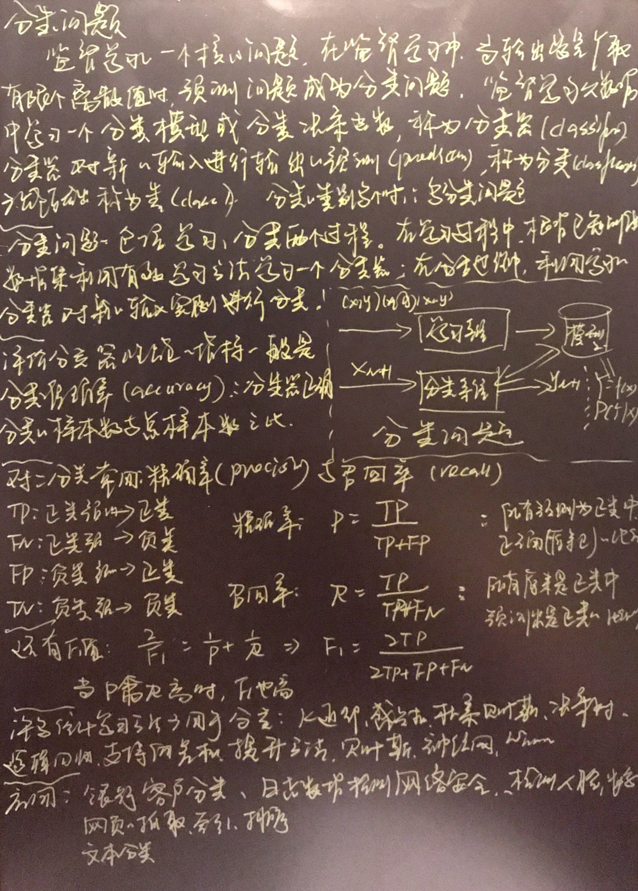      |
|            |           | 1.标注问题：可认为分类的推广。输入观测序列，输出标注序列或状态序列。2.标注的学习系统按照学到的条件按<u>概率分布模型</u>[P(YYYY\|XXX)]对输入观测序列找到相应的输出标记序列。也就是对一个观测序列X = (XXXXX),找到是条件概率P(YYYY\|XXX)最大的概率序列(YYYYY)。3.常用统计学习方法：隐马尔可夫模型、条件随机场。 4应用：信息抽取词性标注。 |       |
|            |           | 1.回归问题：预测输入和输出之间的关系。回归模型：输入到输出的映射的函数。等驾驭函数拟合。      2.回归问题分类：按照输入变量个数：一元回归、多元回归。 按照输入输出关系：线性回归、非线性回归。    3.回归常用损失函数：平方损失函数[最小二乘法求解]。 4.回归应用：商务市场趋势、产品质量管理、客户满意调查、投资风险分析、股价预测。 |  |
|            |           | 1.感知机(Perception):二类分类的线性分类模型。输入特征向量。输出实例类别。   2.模型：判别模型。旨在求将训练数据线性划分的分离超平面。 利用梯度下降法对损失函数及消化，得到感知机模型，分原始形式／对偶形式。   3.感知机预测是用学习到的感知机模型对新输入实例分裂。是NN、SVM的基础。    4.感知机模型：线性分类器。   5.感知机学习策略：求得一个能将训练集正类负类完全分开的分离超平面。定义(经验)损失函数将其极小化，模型参数w\b即感知机模型。 |  |
|            |           | 1.感知机学习算法：转化为求解损失函数的最优问题，最优化方法：SGD。 2.感知机学习算法：原始形式：minL(w, b) = -sum(y(wx+b))。输入：训练集、学习率。输出w.b及感知机模型。   2.1 选取初w\b。 2.2训练集中选取数据。 2.3 y(wx+b) <=0: w  += nyx.  b += ny.   3. 感知机对偶形式：原始：w += nyx。转为增量：w = sum(ayx). b = sum(ay).  算法同理 | 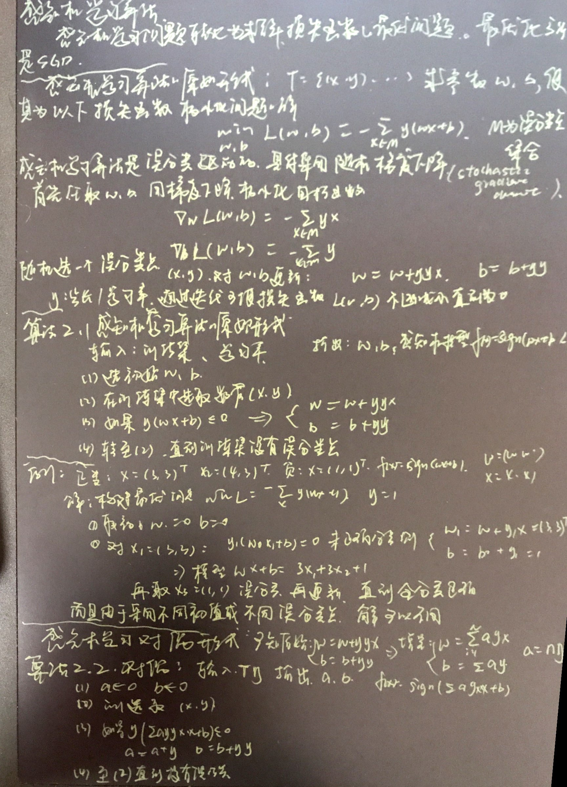 |
|            |           | 1.K近邻：基本分类／回归方法。 输入：实例的特征向量。输出实例的分类。 三要素：K值、距离度量、分类决策。    1.1距离：    Lp=（sum\|x-x\|P）^(1/p).  距离：p=2：欧式距离。 p = 1曼哈顿。1.2K值：k较小，则较小的邻域中训练预测。模型复杂，易过拟合。 k较大则相反。实际选择k较小的。然后交叉验证选择最优k值。   1.3分列决策规则：KNN分类决策多数表决：等价于经验风险最小。      2. KNN算法：输入T，输出y: 2.1根据给定距离度量。在训练集T中找到与x最邻近k的点。  2.2在邻域中根据决策规则(多数表决)决定x的类别y. |  |
|            |           | 1.KNN实现：kd树。主要考虑：如何对训练数据进行快速k近邻搜索：简单实现：线性扫描。耗时，kdtree方法：特殊的结构存储，减少距离的计算。  2. Kdtree:对k维空间实例点村吃以快速检索的树形数据结构。二叉树，表述对k维空间的划分。    3.构造平衡kdtree： 输入k维空间数据集T，输出kdtree。3.1构造根节点。3.2重复。 4.搜索kdtree：利用kdtree进行k近邻搜索：输入已经构造的kdtree。目标x。输出x最近邻。 4.1找到包含目标点x的叶结点  4.2以此叶结点为当前最近点   4.3递归往回退 回到根节点。 | 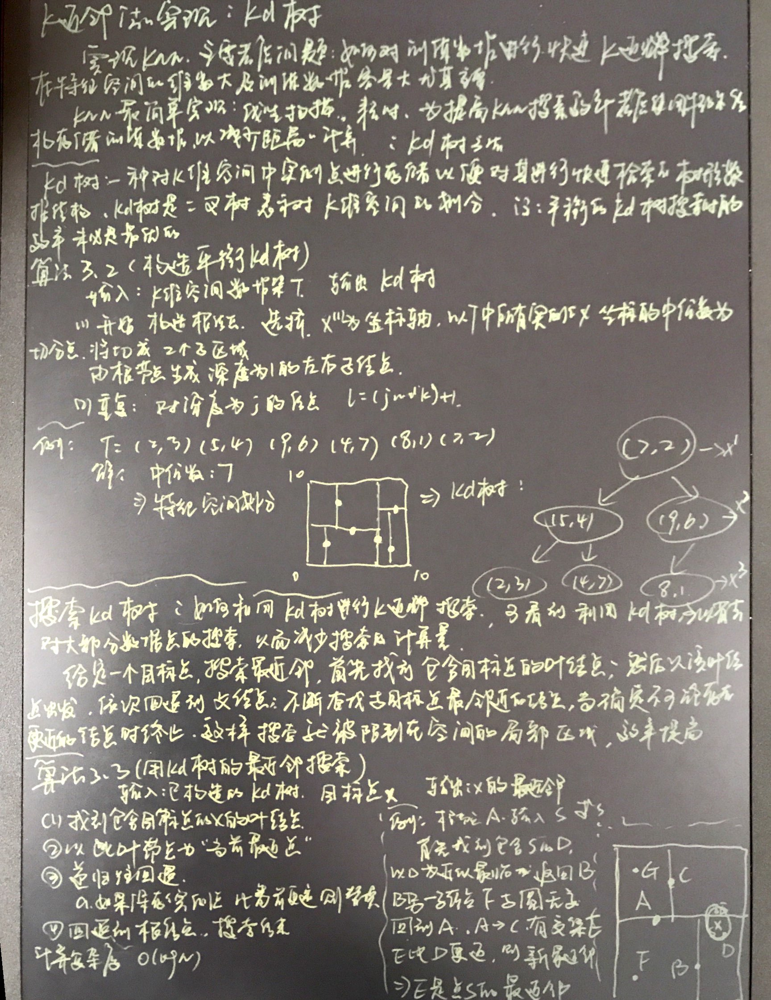 |
|            |           | 1.naive bayes：基于贝叶斯与特征条件独立假设的分类方法。首先基于特征条件独立假设学习输入\|输出的联合概率分布。然后基于此模型，对给定x,利用贝叶斯定理求出后验概率最大的输出y。2.基本方法：输入x 输出y类别   naive bayes通过训练数据集学习联合P(X,Y)。具体学习以下先验概率分布P(Y=c)及条件概率分布P(X=x\|Y=c)[条件独立性假设=multiP(x=x\|y=y)]，属于生成模型。   3.naive bayes分类：给定输入x,通过学习到模型计算后验概率分布P(Y=c\|x=x),然后将后验概率最大的类作为x的类输出。后验概率依据贝叶斯定理进行计算。  4.后验概率最大化含义：等价于期望风险最小化。 | 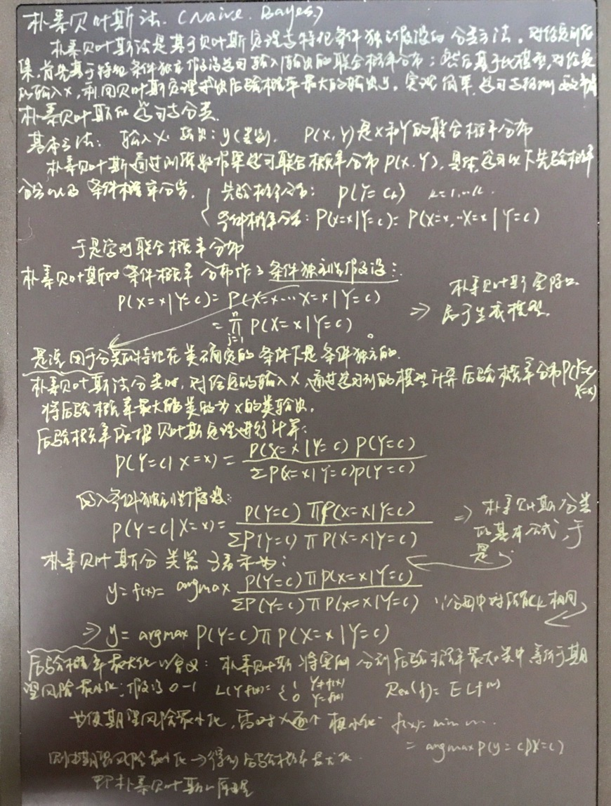 |
|            |           | 1.naive bayes 参数估计：P(X,Y) = P(Y)P(x\|y) 极大似然估计：学习P(y=c)和P(x=x\|y=c)可用极大似然估计相应概率。   2.朴素贝叶斯学习与分类算法：输入训练数据T,实例x.输出x的分类。  2.1计算先验概率及条件概率P(y=c),P(x=a\|y=c)。2.2对给定实例计算P(y=c)multiP(x=x\|y=c) 2.3确定x的类maxP(y=c)multiP(x=x\|y=c)    3.贝叶斯估计：用极大似然估计可能出现概率为0.需要分子分母进行拉普拉斯平滑。 |  |
|            |           | 1.决策树：分类回归方法。if-then的分类规则的集合。条件概率分布。学习时，利用训练数据T，根据损失函数最小化原则建立决策树模型。 预测时，对新数据利用决策树模型进行分类。  决策树3个步骤：特征选择、决策树生成、决策树剪枝。  2.决策树学习：给训练集T。构建一个决策树模型，使对实例能正确分类。  学习策略是损失函数最优化。  3.决策树算法：一个递归的选择最优特征，根据特征对训练数据分割使得各个数据集都有最好的分类。 为了泛化能力，需要剪枝。   4.决策树表示一个条件概率分布。生成考虑局部选择，局部最优。剪枝对应全局选择，全局最优。 |  |
|            |           | 1.特征选择：信息增益：表示得知特征x的信息而使得类Y的信息不确定性减少的信息。  2.信息增益：特征A对数据集D的信息增益g(D,A)=<u>H(D)</u>[经验熵:对D分类的不确定性]-<u>H(D\|A)</u>[经验条件熵:特征A条件下对数据集D进行分类的不确定性]。[类与特征的互信息]、[做差表示由于特征A而对D的分类的不确定性减少的程度]。 可知，信息增益大的特征，有更强的分类能力 |  |
|            |           | 1决策树生成：ID3/C4.5:   ID3采用信息增益选择最大特征A，区分成几个子集，再进行特征选择  C4.5：信息增益比[ID3容易受H(D)大小影响]。   2.决策树剪枝：极小化决策树整体损失函数实现 | 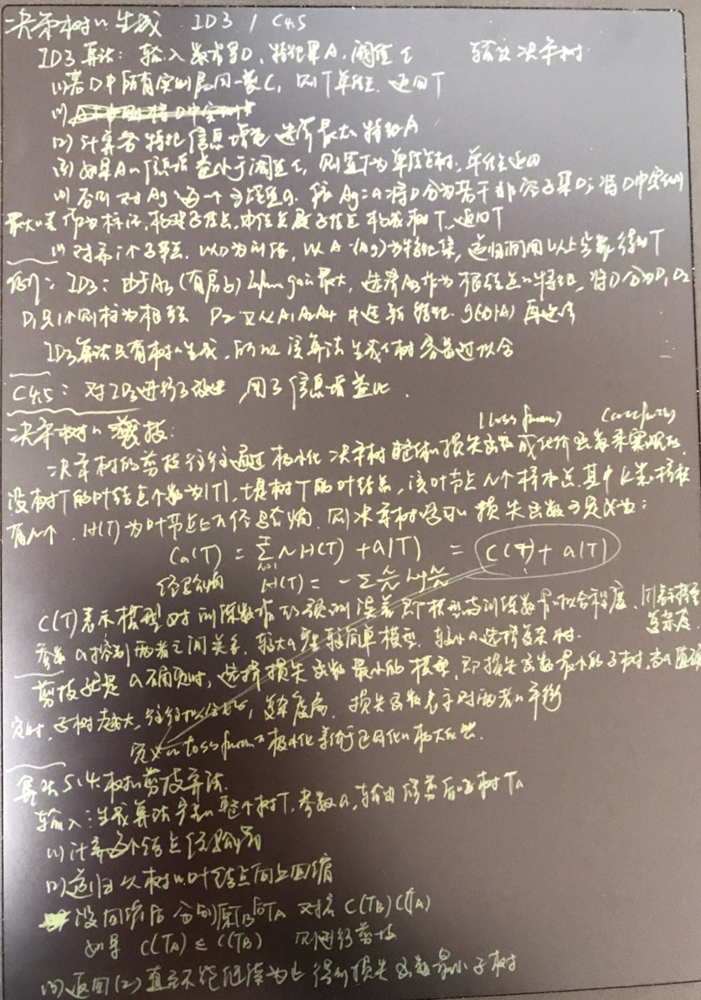   |
|            |           | 1CART(classification and regression tree):可分类可回归：给定输入x输出y的条件概率分布。   两部分组成：决策树生成／决策树剪枝[用验证集剪枝选择最优子树]    特征选择：基尼指数最小化 |  |
|            |           | 1.逻辑回归与最大熵模型：分类方法。对数线性模型。 二项逻辑回归：P(Y=1\|X) P(Y=0\|X)。将实例x分到概率值较大的那一类。  2.逻辑回归用极大似然估计估计模型参数得到模型。即为以对数似然函数为目标函数的最优问题。 常用方法：梯度下降／拟牛顿法。 | 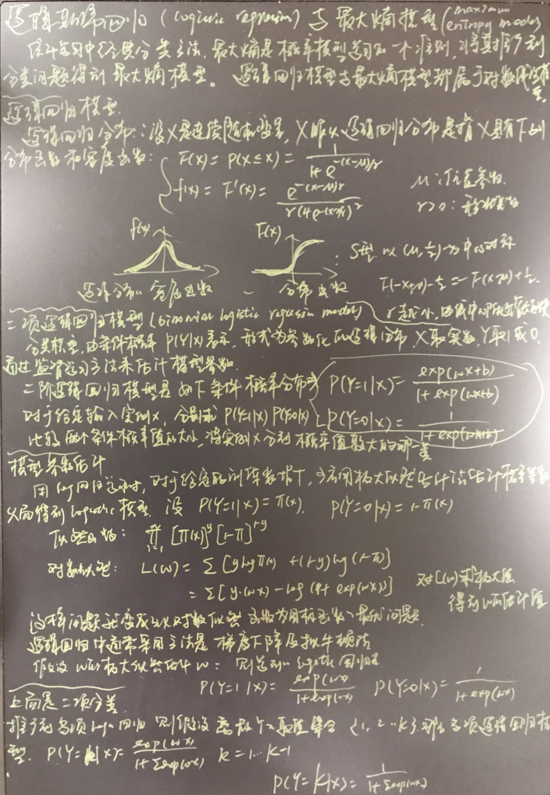 |
|            |           | 1.最大熵模型：所有概率模型分布中，熵最大模型最好。  2.逻辑回归／最大熵：以极大似然估计估计为目标函数的最优化问题。 常用方法：迭代尺度法、梯度下降、牛顿法／拟牛顿法[收敛速度快] | 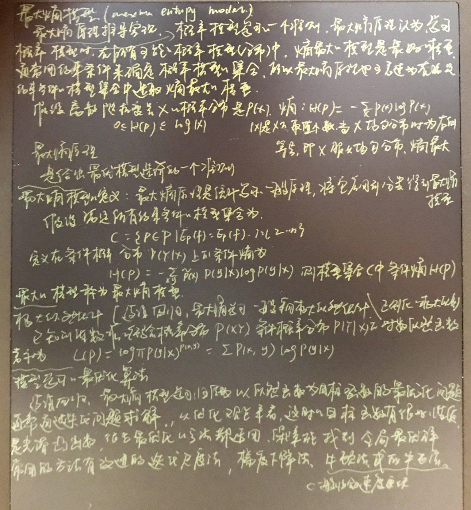 |
|            |           | 1.SVM:二类分类模型：在特征空间上<u>间隔最大</u>[有别于感知机，保障唯一]的线性分类器。核技巧：非线性分类器。   2.SVM学习算法求解凸二次回归最优化算法。    3.SVM分类：当D线性可分：硬间隔最大化：线性可分SVM。 当D近似线性可分：软间隔最大化：线性支持SVM。 当D不可分：核技巧学习非线性支持向量机。    4.线性可分SVM：wx+b =0超平面。函数间隔／几何间隔 |  |
|            |           | 1.间隔最大化：约束问题：max(r). St.y(w/\|w\| + b/\|w\|)>=r[每个样本几何间距至少r]。改写：min1/2\|w\|^2.   St.y(wx+b)-1>=0.   [凸二次优化问题]     2线性可分SVM学习算法：最大间隔法：输入T,输出最大间隔超平面及分类决策函数。  2.1构造并求解最优化问题，得到w\b 2.2得到超平面、决策函数。     3.线性可分下：D样本点中与分离超平面距离最近的样本点：支持向量。使得y(wx+b)-1=0.[很少重要训练样本确定] | 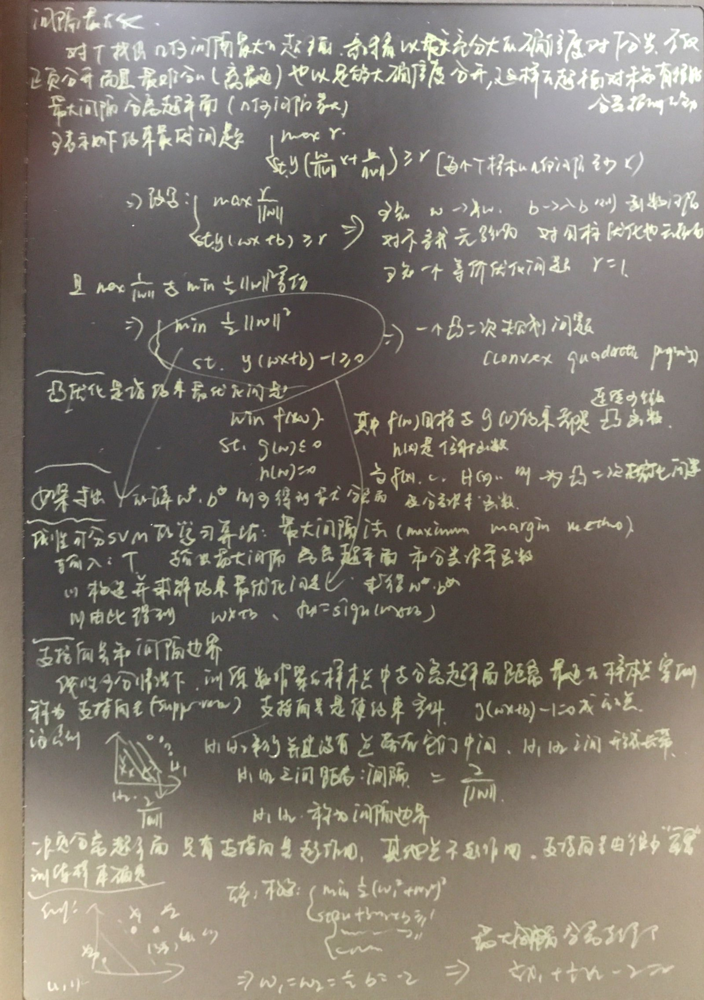 |
|            |           | 1.对偶算法：更容易求解。最终：w = sum(ayx)  b = y-sum(ay(xx))  2.线性可分SVM学习算法:输入T、输出分类： 构造min..计算w\b。 | 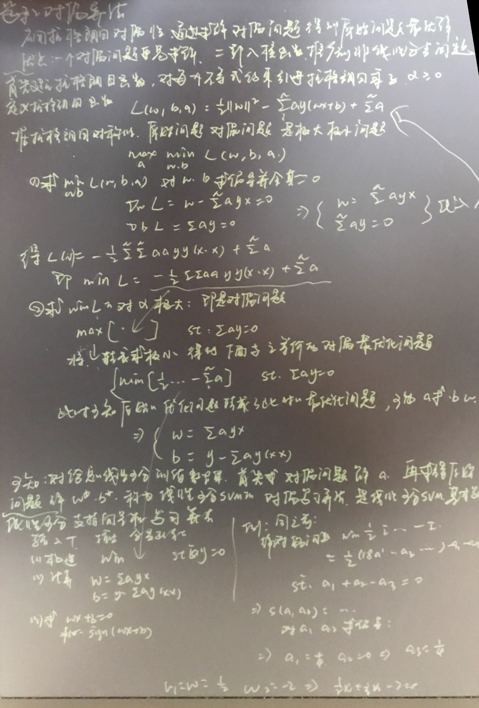    |
|            |           | 1.线性支持向量机：线性不可分意味着不满足函数间隔>=1的约束条件。 引进松弛变量。eta.: y(wx+b) >=1-eta。  2学习算法：间隔边界距离eta/\|w\| | 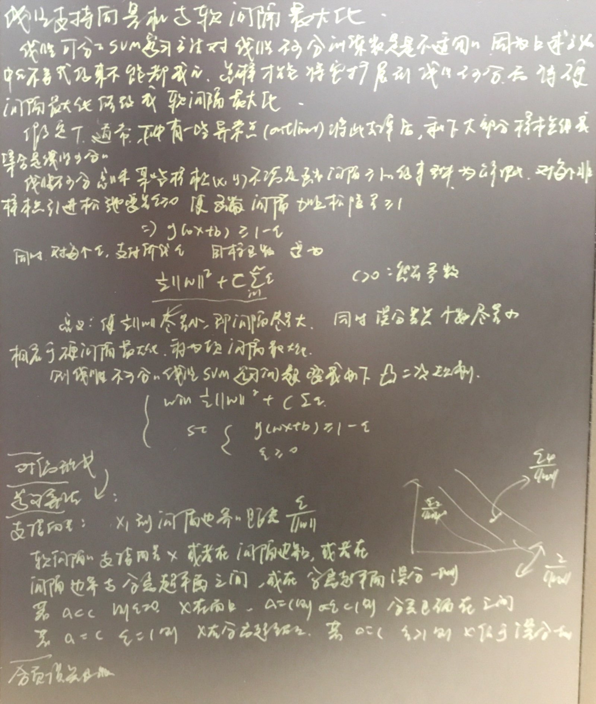 |
|            |           | 1.非线性SVM:核技巧。 常用；非线性变换。 空间映射。  2.核技巧：只定义核函数(k(x,z))不显式定义映射函数。   3.常用核函数：多项式／高斯 | 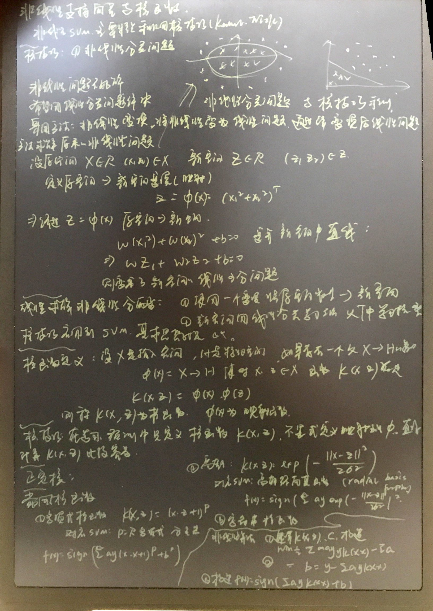 |
|            |           | 1.序列最小最优化算法(sequential minimal optimization)SMO：SVM的实现问题：凸二次规划问题：全局最优解。  2SMO算法：输入T输出近似解x. | 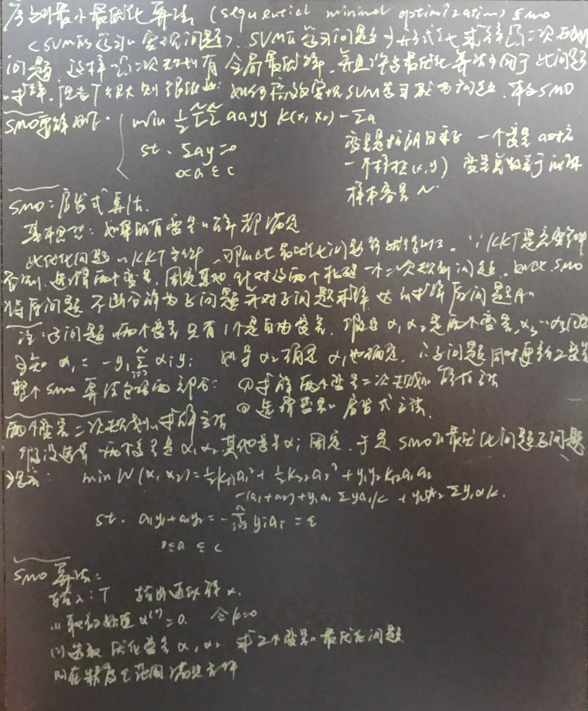 |
|            |           | 1.提升方法(boosting)：分类问题中，改变训练样本权重，学习多个分类器，并线性组合，提高分类性能。  2.AdaBoost提升方法：对复杂任务，对多个专家判断进行适当综合。   3.弱可学习：一个多项式学习仅仅比随机效果略好。一个粗糙的弱分类规则较容易。   4.提升方法：从弱学习算法出发，反复学习，得到一系列弱学习分类起。然后组合，得到强分类器。  5.1AdaBoost 提高那些被前一轮弱分类起错误分类样本的权重。分而治之。 5.2采用加权多数表决。加大分类误差小的弱分类器的权重。   6. 输入T、输出最终分类器： 6.1初始化权重分布。 6.2.1得到基本分类器。6.2.2计算分类起误差率。6.2.3计算系数。6.2.4更新权重。 6.3构建基本分类器组合。得到最终分类器。 |  |
|            |           | 1.AdaBoost例子：初始化权重-计算误差率-计算系数-更新权重分布-迭代以上过程。最终得到分类器组合。  2.AdaBoost基本性质：在学习过程中不断减少训练误差。 |  |
|            |           | 1提升树(boosting tree): 以分类、回归为基本分类器的提升方法。提升树是统计学习中性能最好的方法之一。    采用加法模型与前向分布算法。以决策树为基函数的提升方法。  分类问题二叉分类树，回归问题二叉回归树。    2. 回归问题的提升树算法：初始化-拟合-更新-得到回归问题提升树 |  |
|            |           | 1.梯度提升：提升树利用加法模型与前向分布算法实现学习的优化过程。   2. 利用损失函数的负梯度。 3.梯度提升算法：初始化-拟合-更新   4.前向分布算法：加法模型f(x) = sum(beta*r) |  |
|            |           | 1.EM算法：迭代算法：含有隐含变量的概率模型参数的极大似然估计或极大后验概率估计。  2.E步求期望。M步求极大似然估计。    3.概率模型变量都是观测变量可直接极大似然估计／贝叶斯估计。  但是模型有隐变量就不能用此。    4 EM:含有隐含变量的概率模型参数的极大似然估计。 |  |
|            |           | 1.EM算法：选取参数初始值、迭代计算，直到收敛。                |   |
|            |           |                                          |             |
|            |           | 1.隐马尔可夫模型：标注问题的统计学模型：生成模型。关于时序的概率模型。 A状态转移概率矩阵 B观测概率矩阵 pi初始状态概率向量。 |     |
|            |           | 1.                                       |     |
|            |           |                                          | 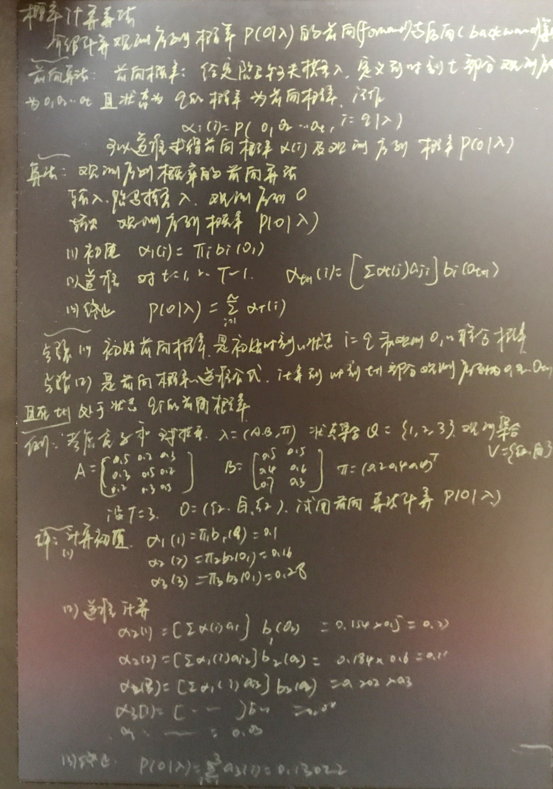 |
|            |           |                                          | 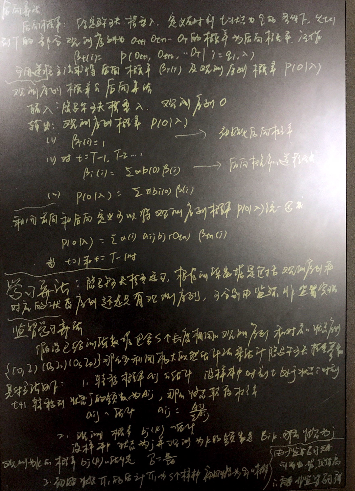 |
|            |           |                                          |  |
|            |           |                                          | 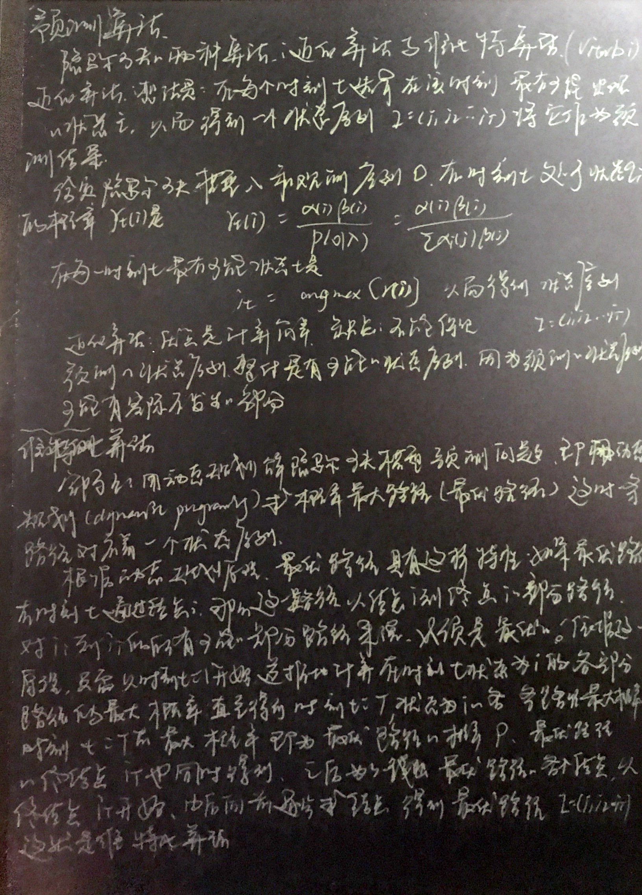 |
|            |           |                                          |   |
|            |           |                                          |  |
|            |           |                                          | 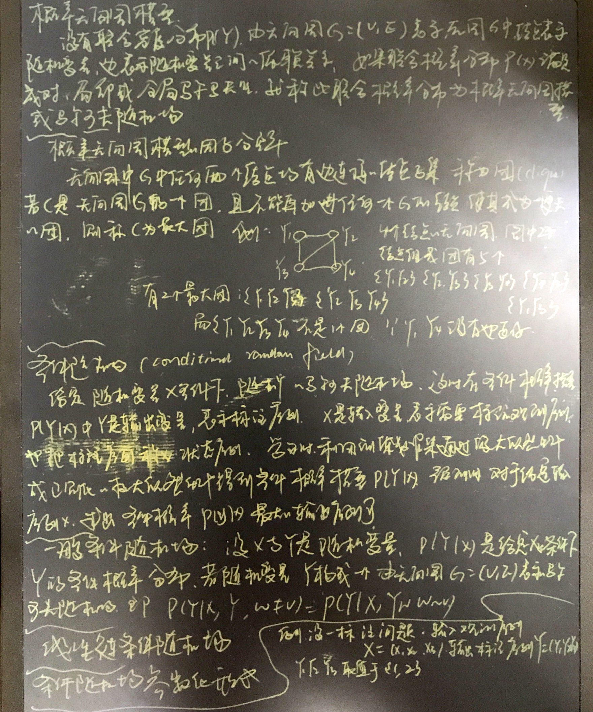 |
|            |           |                                          |   |
|            |           |                                          |  |
|            |           |                                          | 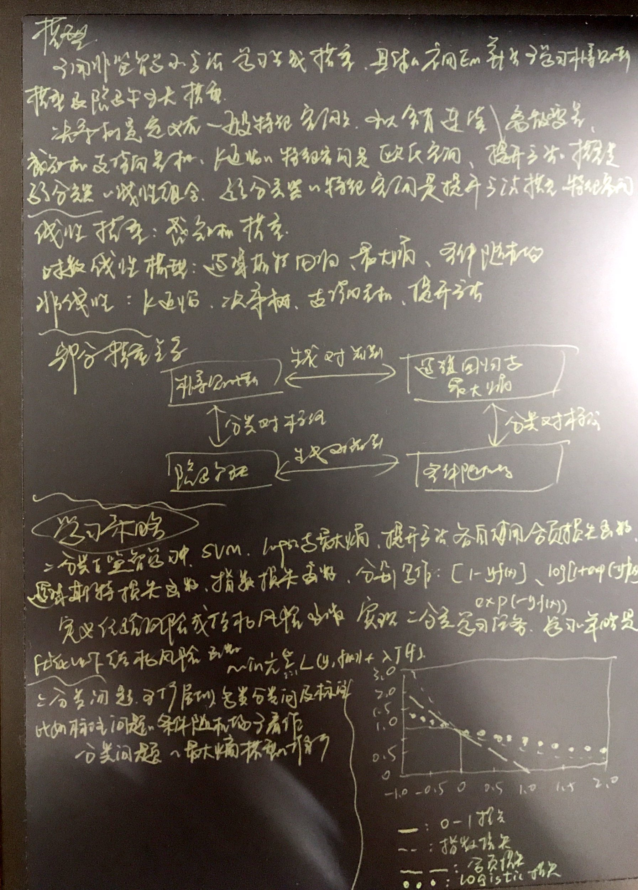    |
|            |           |                                          |           |
|            |           |                                          |           |
|            |           |                                          |                                          |
|            |           |                                          |                                          |