注：为个人学习总结需要，如有侵权，请您指出。[持续更新， 如有错误，请您指出]        

> 邮箱：*<u>yangqiokay@foxmai.com</u>*      微信号：<u>*18810578662*</u>

​    

## **「当下唯一一件事：CV」**

------

### A.关于「CV」「技能&专业书」：3／num

### **[3.机器学习]()**

| 三次总结&忌盲目乐观 | 二次总结&能讲出来       | 背诵条目&一次总结                                | 参考理解                                     |
| ---------- | --------------- | ---------------------------------------- | ---------------------------------------- |
|            | **第一章开始：绪论**    |                                          |                                          |
|            |                 | **1. 没有免费的午餐：**：总误差率与学习算法无关；学习算法要与问题相匹配；  **2.大数据时代三大关键技术：**机器学习：数据分析能力； 云计算：数据处理能力；众包：数据标注能力  **3.数据挖掘：**机器学习和数据库是数据挖掘的两大支柱 |  |
|            | **第一章故事**       | **1. IBM提出机器学习：**西洋跳棋程序；用到了**强化学习**      | 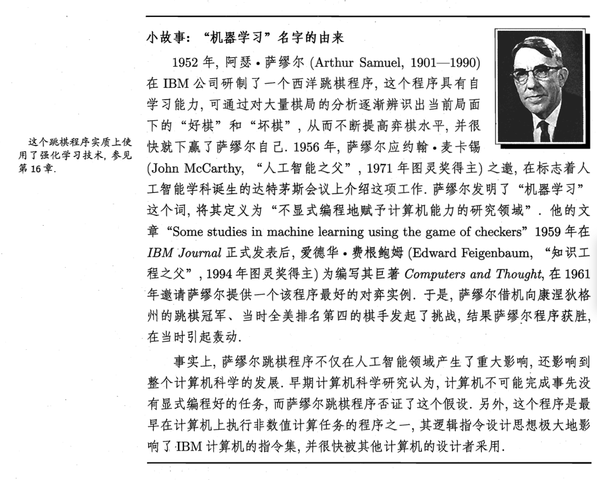                       |
|            | **第二场：模型评估与选择** |                                          |                                          |
|            |                 | **1.评估方法：** 得到训练集S、测试集T:  **留出法**：(hold-out)直接讲数据集D划分为两个互斥的集合，一个做训练集，一个做测试机；并随机划分多次；留出法返回的是多个结果的平均。**交叉验证法：** 数据集划分k个大小相似互斥子集：每个子集中分层抽样：用k-1个训练，剩下测试。可进行k次训练测试，返回k次均值。 若k=m则留一法。 **自助法bootstrapping：** 在留出法和交叉验证中保留了一部分用作测试，实际用的训练集合小。 自助法(bootstrapping)可重复采样，有回采样：采样产生数据集D‘，每次从D中挑选一个样本，复制到D'中，再返回数据集D。重复m次，得到包含m个样本的数据集。在数据集小、很难划分时有用。 |                                          |
|            |                 | **1.性能度量：** 衡量模型泛化能力的评价指标；反映了任务需求：**回归任务：**均方误差MSE：更一般数据分布D及概率密度函数p，均方误差：表示称期望形式。 **分类任务：**查准率：预测是正的中原来是正的比例 ；查全率：原来是正的，预测是正的比例。 我们可根据学习器的预测结果对样例进行排序，排在前面是最可能正例的样本，每次计算当前查全率、查准率：得到P-R曲线。F1度量；Fb度量；**ROC与AUC** : ROC：横纵坐标的工作特征；随机猜想；有限测试样例不光滑；判断比较：ROC下面积AUC：**代价敏感错误率与代价曲线**：不容损失的大小不同。ROC不能直接反应学习器的期望总体代价，代价函数可以。 | ---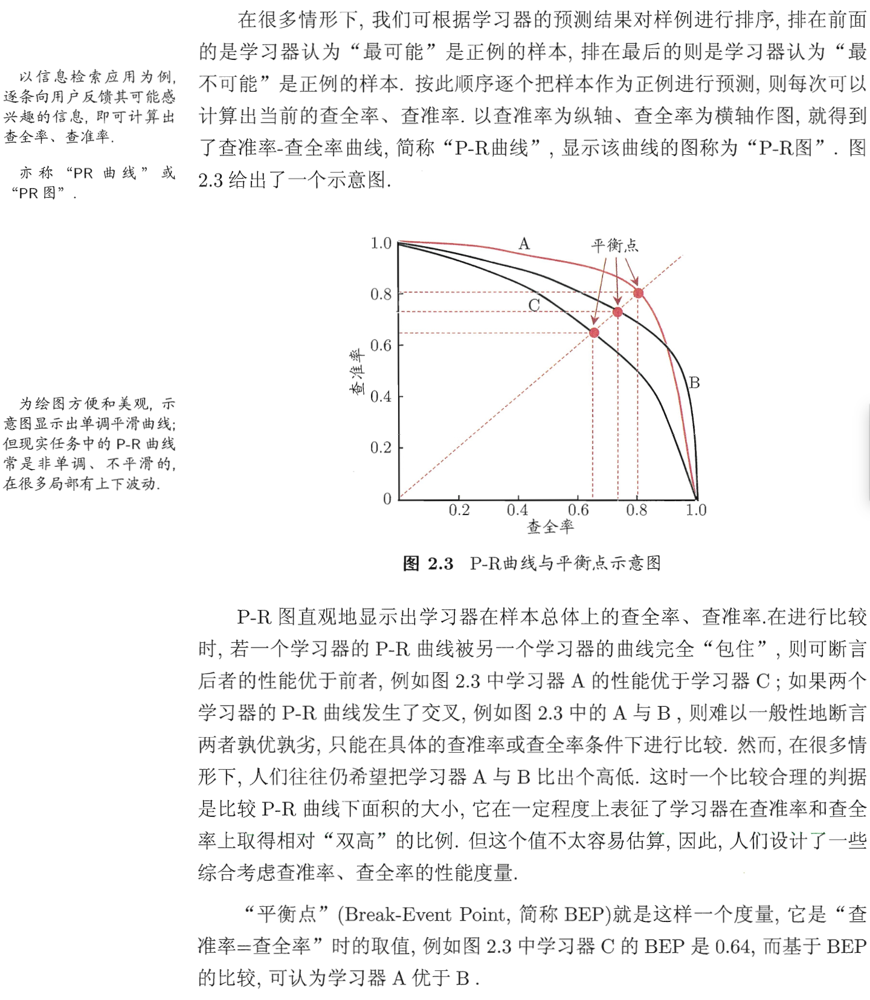---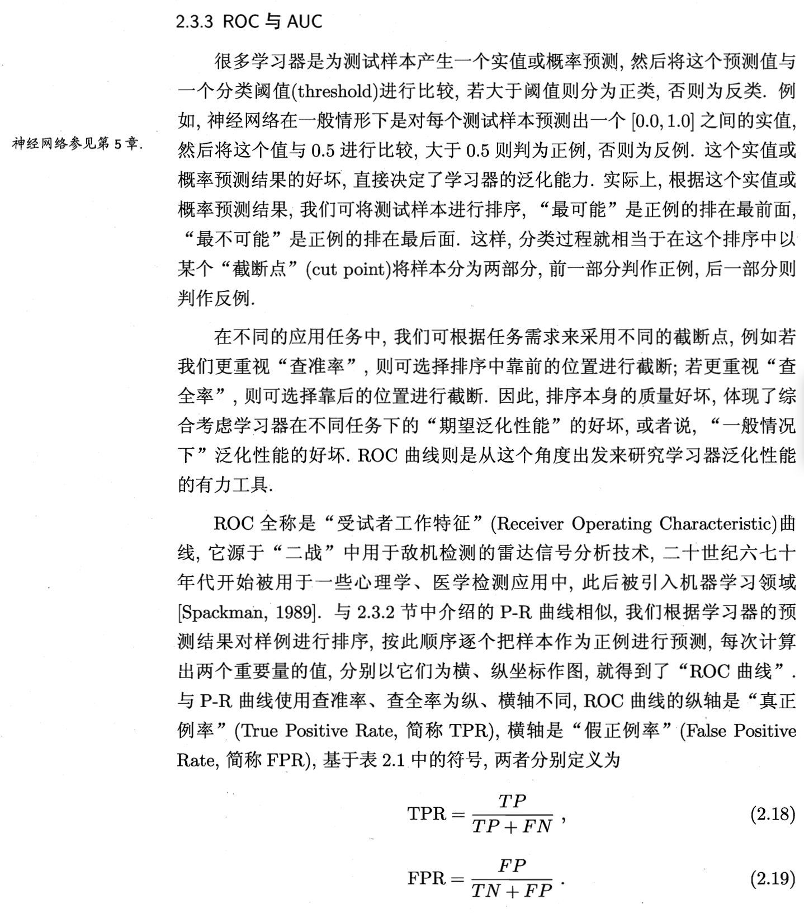---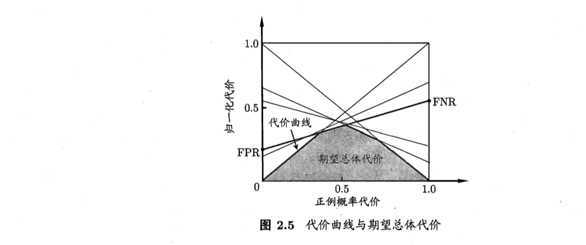 |
|            |                 | **1.比较检验：** 性能比较：泛化性能；测试集训练集选择；随机性： **统计假设检验**：假设检验：交叉验证t检验：McNemar检验；Friedman检验； |                      |
|            |                 | **1.偏差与方差：**泛化误差可分解为：偏差、方差、噪声之和。**偏差**度量了学习算法的期望预测与真实结果的偏离程度：算法本身的拟合能力。 **方差**：同样大小训练集变动导致学习性能的变化：数据扰动造成的影响；**噪声**表示当前任务上学习算法达到的期望泛化误差下界：问题本身的难度。**泛化性能**由学习算法的能力、数据的充分性、学习任务的难度共同决定。   **给定学习任务，为了取得好的泛化性能：**需要偏差较小即能充分拟合数据，并方差较小：即数据扰动产生的影响小。；**偏差方差窘境** |   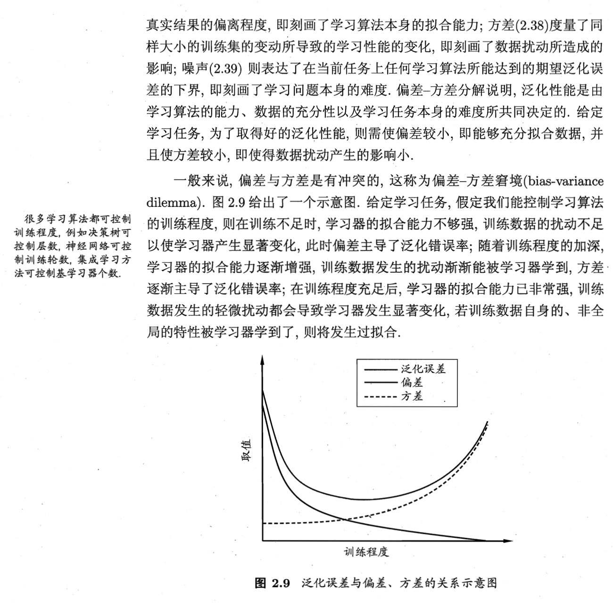 |
|            | **第三章开始：线性模型**  |                                          |                                          |
|            |                 | 1.线性组合 2.线性回归：均方误差，最小二乘法；多元线性回归；对数线性回归；对数几率；极大似然法；**线性判别分析LDA:**经典线性学习方法，又称Fisher判别分析：给定训练样例，设法将样例投射到一条直线上，使得同类样例的投影点尽可能接近、异类样例投影点尽可能远离： 可以让同类样例投影点的协方差尽可能小，让异类样例投影点尽可能远离，让类中心距离尽可能大：定义类内散度矩阵。即是LDA最大化的目标。LDA经典监督降维技术。 | ---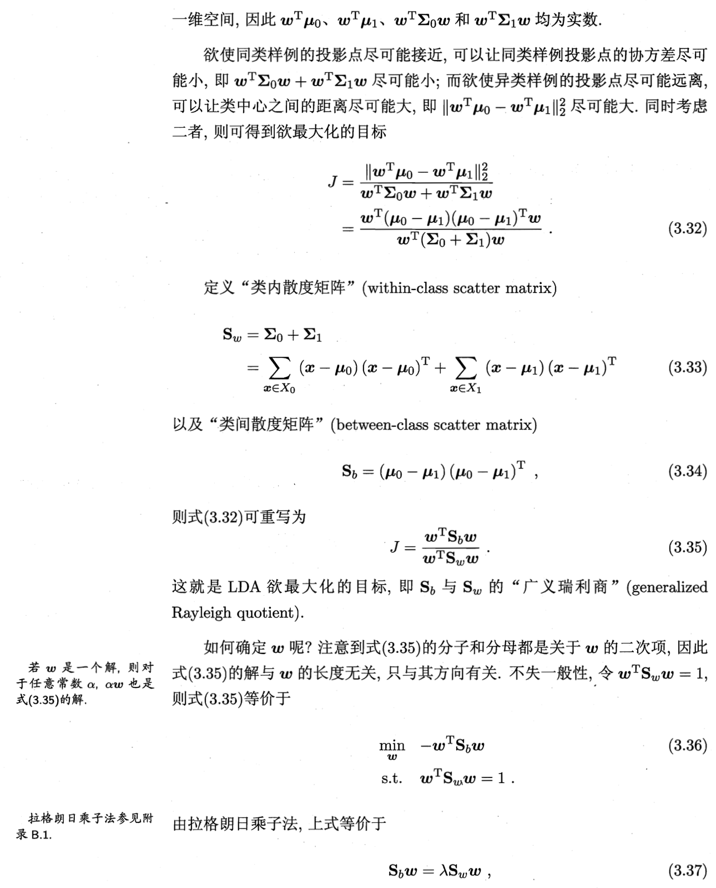 |
|            |                 | **1.多分类学习：**基本思路：**拆解法**：将多分类任务拆为若干个二分类任务求解：先对问题拆分，为拆出的每个二分类任务训练一个分类器；在测试时，对这些分类器的预测结果进行集成获得最终的多分类结果。关键是如何对多分类任务拆分，以及多个分类器集成。**经典拆分策略3种**：一对一：一对其余；多对多：给定数据集：一对一将N个类别两两配对：产生Cn2个二分类任务： 一对其余：一个类的样例作为正例，其他作为反例，训练N个分类器。可知OVO的存储开销和测试时间开销更大。在类别很多时OVO训练时间更小。 MVM是每次若干了类为正类，其他反类：常用技术ECOC |  |
|            |                 | **1.类别不平衡问题**： 分类中不同类别的训练样例数目差别很大；类别不平衡学习的一个基本策略：“再放缩”； 3类做法：第一类：直接对训练集反类样例进行“欠采样“即去除一些反例使得正、负数目接近，然后再进行学习；时间开销小，因为训练集远小于初值训练集。第二：对训练集的正类样例多采样：即增加正例使得正负例数量接近。 训练集合大雨初始训练集。第三：直接基于原始训练集学习但是进行阈值移动。即：分类器预测几率高于观测几率 |   |
|            | **第三章总结**       |                                          |                      |
|            | **第四章开始：决策树**   |                                          |                                          |
|            |                 | **1.决策树基本流程：**分而治之策略 **2.剪枝：基本策略**：预剪枝，后剪枝：**3.如何判定决策树泛化性能如何提升**：性能评估方法  **4.连续与缺失值**：4.1**连续值处理**：不能直接根据连续属性的可取值对节点进行划分：连续属性离散化技术：二分法对连续属性处理 C4.5  4.2**缺失值处理** ：如果在属性值缺失情况下划分属性选择 ；给定划分属性，若样本在该属性缺失，怎样对该样本划分：问题一：D'为D在属性上没有缺失值的样本子集：根据D'判断属性的优劣。问题二：若划分已知，将x划入对应子节点。若划分为之：划入所有子节点：调整不同权重：无缺失值样本中在属性a上样本所占比例。 | 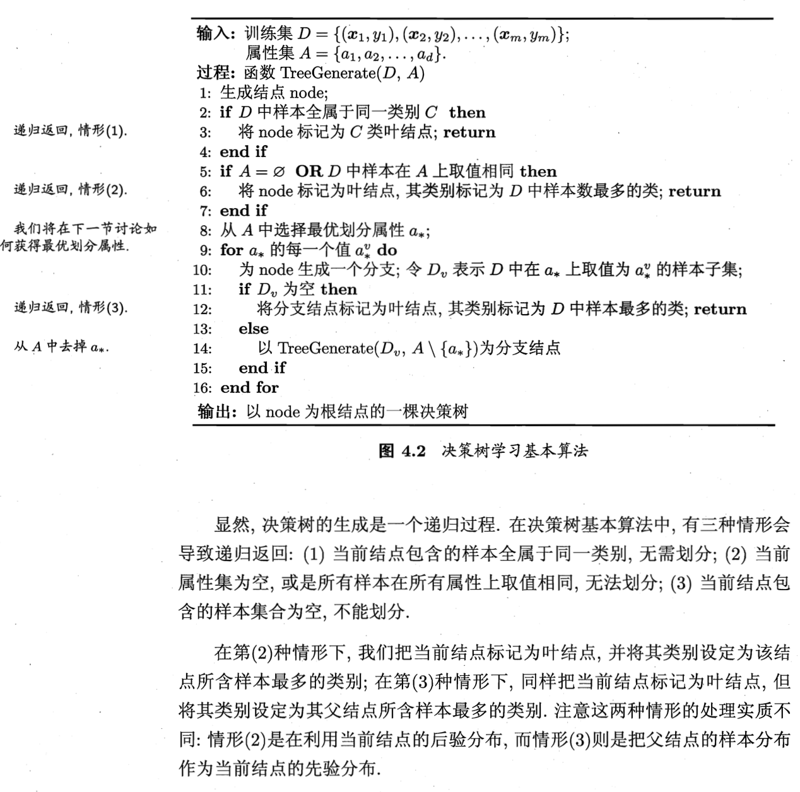--- 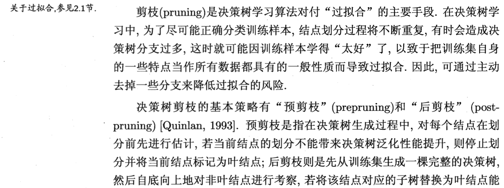 --- 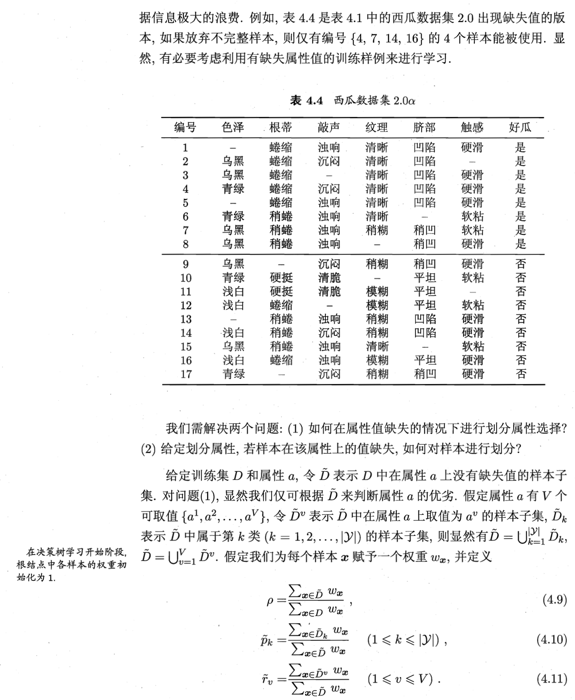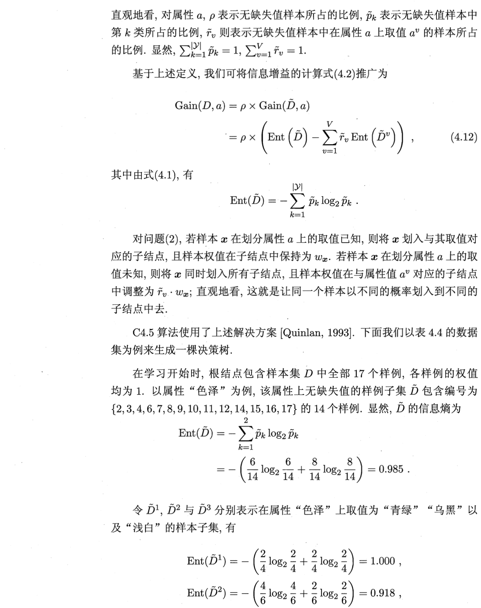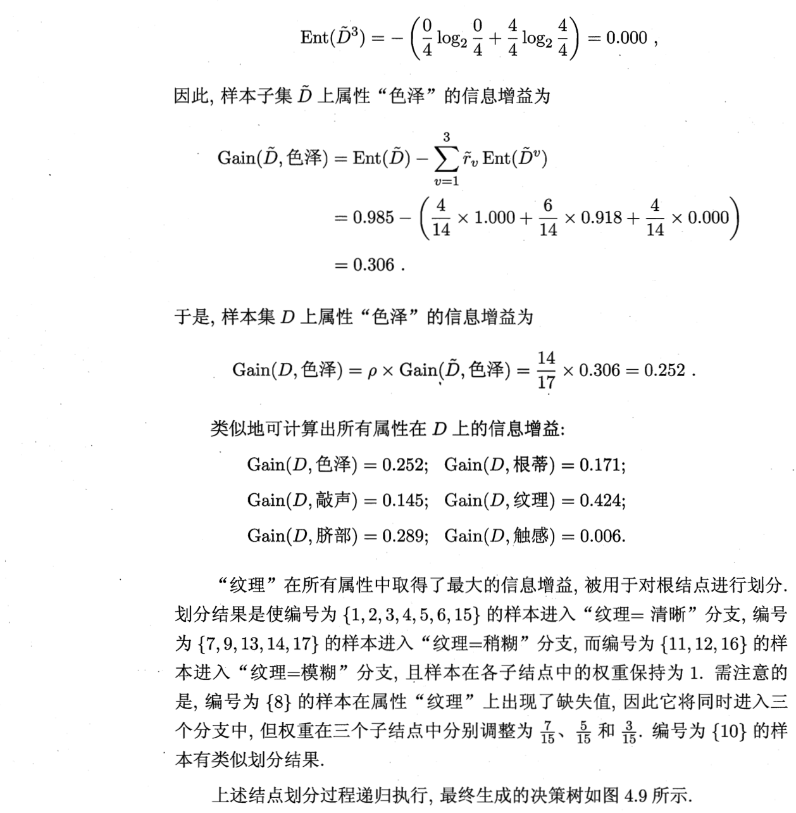 |
|            | **第四章总结**       |                                          | 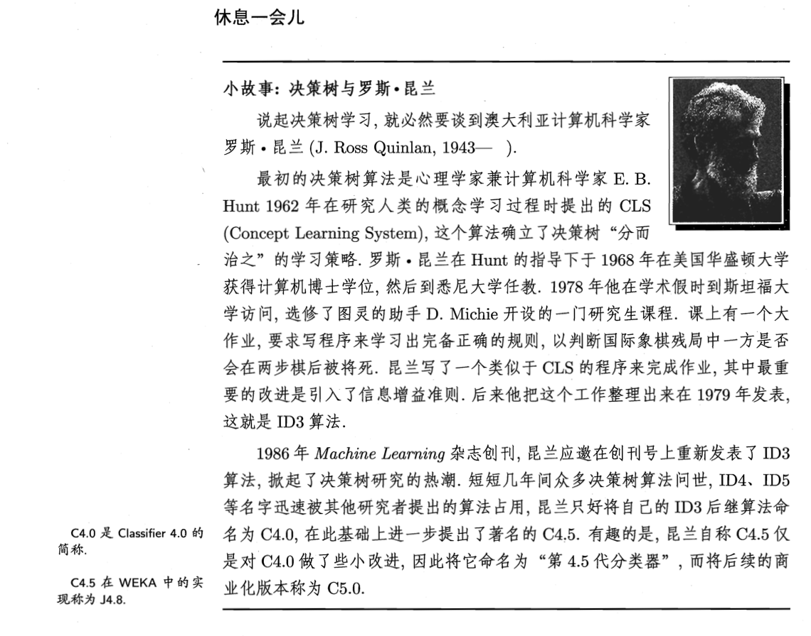                     |
|            | **第五章开始：神经网络**  |                                          |                                          |
|            |                 | **1.神经网络：**具有适应性的简单单元组成的广泛并行互联的网络，它的组织能模拟生物神经系统对真实世界物体所做出的交互反应。神经元模型M-P神经元模型。**感知机与多层网络**：由2层神经元组成：输入层接收输入信号后传递给输出层，输出层是M-P神经元或阈值逻辑单元：能实现逻辑与、或、非运算。解决非线性可分：多层功能神经元；多层前馈神经网络；前馈：不是信号不能往后传，而是网络拓扑结构上不存在环或回路。 | 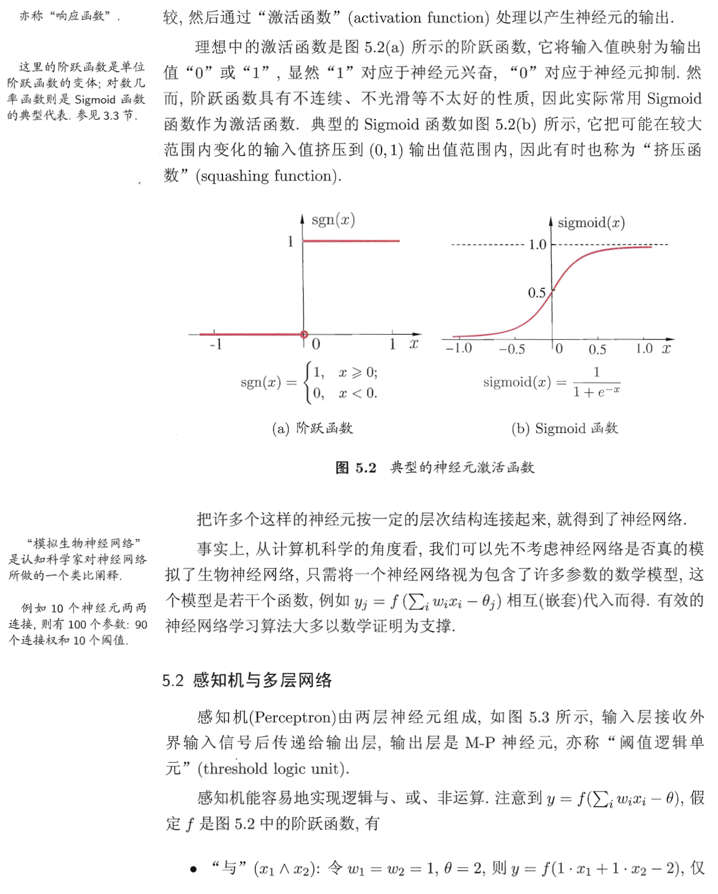 |
|            |                 | **1.反向传播算法**：给定训练集：对训练例，假设输出y,得到均方误差e；BP是一个迭代学习算法，迭代每一轮采用广义感知机学习规则对参数估计。基于梯度下降，调整w,影响最后均方误差，得到更新权重即更新偏执。 **BP算法**：现将输入示例提供给输入层神经元，逐层信号前传，直到产生输出层的结果；然后计算输出层的误差。再将误差逆向传播至阴层神经元，根据阴层神经元的误差对连接权和阈值进行调整；迭代循环进行，直到达到停止条件。Bp目标：最小化训练集上累计误差；**累计误差逆传播**：标准BP每次针对一个样例，参数更新频繁。累计BP直接针对累计误差最小化，在整个训练集一遍后才更新参数。。在很多问题中，累计误差下降到一定程度，进一步下降缓慢，标准BP更快获得较好的解，尤其是训练机D非常大；如果设置隐层神经元个数：试错法调整。 **缓解BP网络过拟合：**： 一：早停：将数据分成训练集、验证集：训练机用来计算梯度、更新权重阈值。验证机用来估计误差。若训练机误差降低但验证集误差升高，则停止训练，返回具有最小验证集误差的连接权重和阈值。二：正则化：在误差目标函数中增加用于描述网络复杂度的部分利于连接权重与阈值的平方和。lamda用于对经验误差与网络复杂度进行折中。交叉验证来估计。 |  |
|            |                 | **1.全局最小与局部极小:** ：E是NN在训练集上误差，是关于连接权重w和阈值b的函数。 NN的训练过程：参数寻优过程，在参数空间寻找一组最优参数使得E最小。 两种最优：局部极小、全局最小。基于梯度的搜索是最广泛的参数寻优方法：从初始解出法，迭代寻找最优参数值。每次迭代中，先计算误差函数在当前点点的梯度，然后根据梯度确定搜索方向，容易参数寻优陷入局部极小。：采用以下策略试图“跳出”局部极小，接近全局最小：**一：**以多组不同参数值初始化多个神经网络，按标准方法训练后，取其中误差最小的解作为最终参数。相当于不同初始点开始搜索，可能陷入不同局部极小，从中选择有可能获得全局最小的结果。**二：** 使用模拟退火技术：在每一步都以一定的概率接受比当前解更差的结果，从而有助于跳出局部极小。每次迭代过程中，接受“次优解”的概率要随着时间的推移逐渐降低，保证算法稳定。 **三：** 使用随机梯度下降，与标准梯度下降法准确计算梯度不同，随机梯度下降法在计算梯度时，加入了随机因素。于是即使陷入局部极小点，计算出的梯度可能不为0，可跳出局部极小继续搜索。  遗传算法也可用来训练神经网络以更好逼近全局最小。(多是启发式，理论缺乏保障) |  |
|            |                 | **1.其他常见神经网络**：**1.1RBF网络：**：径向基函数网络：单隐层前馈神经网络：使用径向基函数作为隐含层神经元激活函数，而输出层则是对隐含层神经元输出的线性组合。假定输入、输出，则RBF网络可表示为：径向基函数：某种沿径向对称的标量函数，定义为样本x到数据中心c之间欧氏距离的单调函数。通常采用两部来训练RBF网络：第一步确定神经元中心c，常用方式包括随机采样、聚类等，第二步，利用BP算法确定参数w／b ；**1.2 ART网络**：竞争型学习是神经网络中一种常用的无监督学习策略，在使用该策略时，网络输出神经元相互经侦，优胜激活，胜者通吃。 ART是竞争型学习代表：**1.3SOM网络**  **1.4级联相关网络** ；**1.5Elman网络** **1.6Boltzmann机** NN中有一类模型是为网络状态定义一个能量。能量最小化的网络达到理想状态，网络的训练就是最小化能量函数。递归神经网络；神经元分为显层、隐层。显层用来表述数据的输入与输出，隐含表述数据的额内在表达。Blotzmann机中的神经元都是布尔形，只取0/1. Boltzmann机的训练过程就是每个训练样本作为一个状态向量。使其出现的概率尽可能大。标准Boltzmann机是全连接图，复杂度高，难以解决现实任务。现实中常采用受限Boltzmann机：仅仅保留显层与隐层的连接，从完全图简化为二部图。常用对比散度进行训练。 | 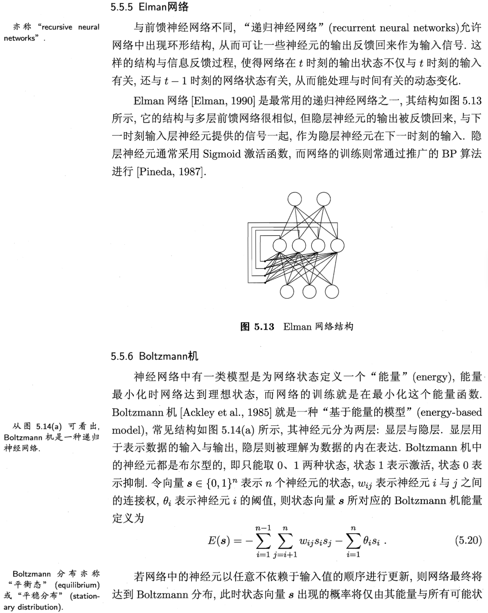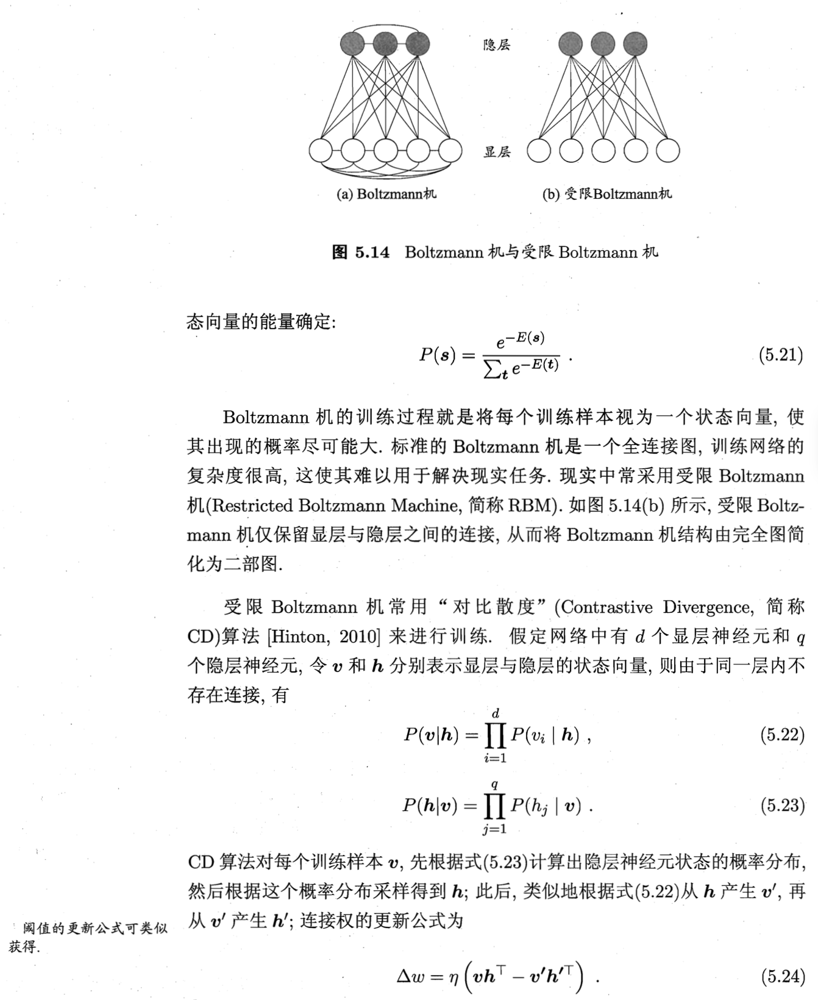 |
|            |                 | **1.深度学习** 参数越多模型越复杂，容易过拟合；**一：**无监督逐层训练是多隐层网络训练的有效手段，每次训练一层隐节点，训练时将上一层隐节点的输出作为输入，本层隐节点的输出作为下一层输入，称为预训练，全部完成后，再对整个网络微调训练。 深度信念网络DBN中每一层都是受限Boltzmann机，使用无监督逐层训练时，先训练第一层，是关于训练样本的RBM模型。然后逐层预训练，再利用BP算法对整个网络进行训练。  **二：** 节省训练开销策略：权共享：让一组神经元有相同的连接权重，在CNN卷积NN中很重要。CNN可用BP算法训练 |  |
|            | **第五章总结**       |                                          | 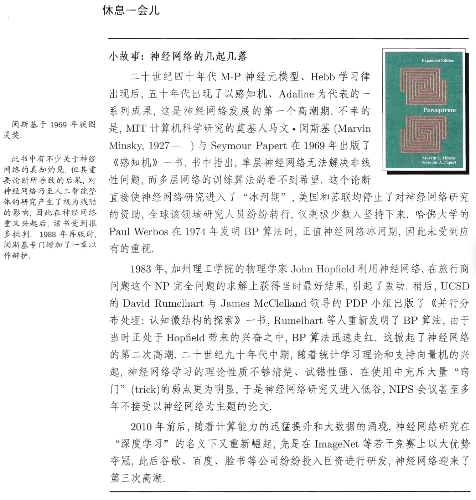                     |
|            | **第六章开始支持向量机**  |                                          |                                          |
|            |                 | **1.最大间隔；**等价最小化问题；凸二次规划问题；对偶问题：另对偶问题的偏导数为0得到a,得到w,b。KKT条件；求解对偶函数：二次规划问题，但问题规模正比于训练样本数量，**采用SMO算法：** 先固定a之外的所有参数，然后求a上的极值，由于存在约束，固定a之外的变量，则a可由其他变量导出，于是SMO每次选择两个变量aiaj并固定其他参数，在参数初始化后，SMO不断执行如下两个步骤直到收敛。  -选取一对需要更新的变量aiaj，固定aiaj以外的参数，求解得到更新后的aiaj。 SMO采用启发式：使得选取的两变量所对应样本之间的间隔最大。这样的两个变量有很大差别，会给目标函数值更大的变化 | 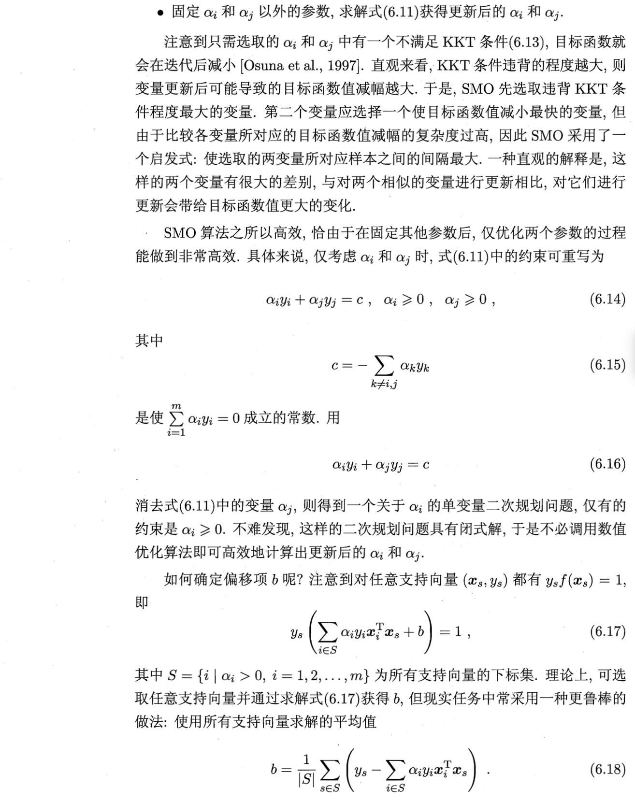 |
|            |                 | **1.核函数：** 可讲样本从原始空间映射到一个更高维的特征空间，使得样本在这个特征空间内线性可分，就能找到一个合适的划分超平面。 如果原始空间有限维，即属性有限，一定存在一个高危特征空间是样本可分。可知对偶问题涉及到x映射到特征空间之后的内积，由于特征空间维数可能很高、可能无穷，直接计算很困难，可以将x在特征空间中内积等于它们在原始样本中通过函数k()计算的结果。这样就不必去计算高维甚至无穷维特征空间中的内积。显然，若已知合适的映射函数具体形式，则可写出核函数，但现实任务中不知道是什么形式，那么合适的核函数是否一定存在呢？ **核函数：** 另x为输入空间，k为对称函数。可知只要有一个对称函数对应核矩阵半正定，就能作为核函数使用。核函数选择是SVM的最大变数，很可能性能不佳 | 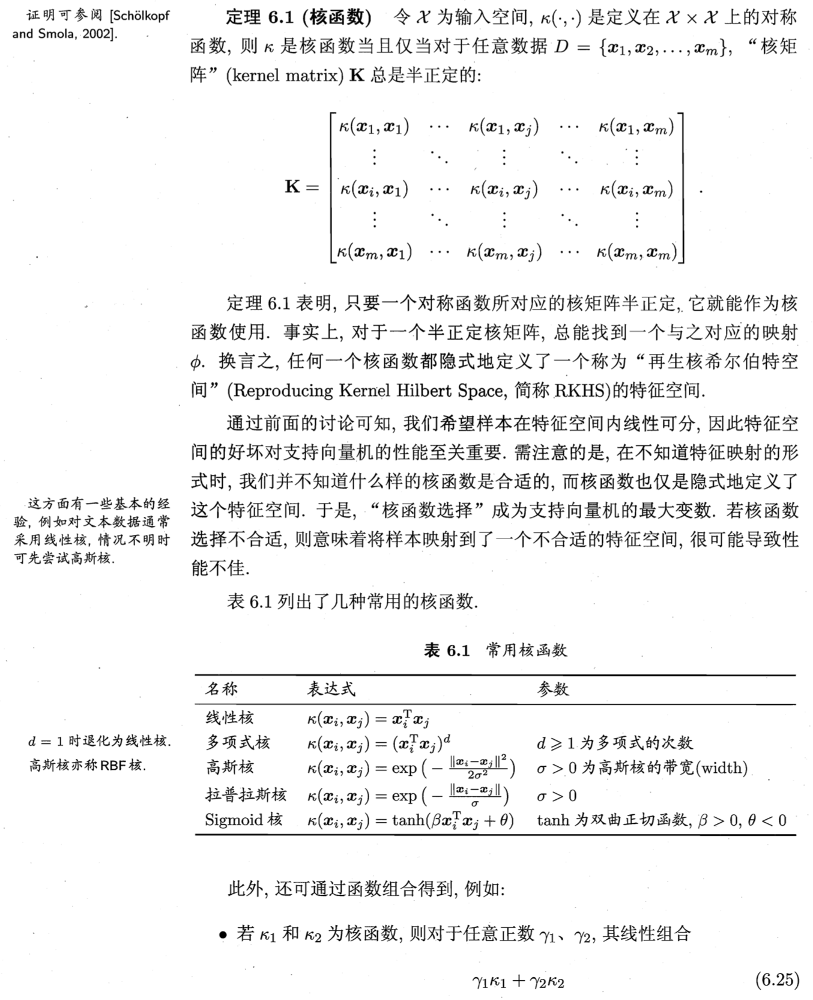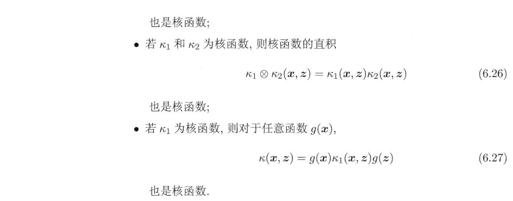 |
|            |                 | **1.软间隔与正则化**： 我们假定训练样本空间或特征空间中是线性可分的。但是现实任务中很难准确确定合适的核函数使得训练集在特征空间中线性可分。或者即便找到了某个核函数使得训练集在特征空间中线性可分，也很难断定这个结果不是过拟合造成。缓解该问题的办法：允许SVM在一些样本上出错：**软间隔** ：允许某些样本不满足约束，当然也是尽可能少，优化目标。又0-1损失函数非凸、非连续，数学性质不太好，不易求解。于是用其他函数代替：通常是凸的连续函数且是0-1损失函数的上界。 三种常用替代损失函数：hinge、指数、对数。也就是**软间隔支持向量机** ，可知与硬间隔下的对偶问题唯一不同的是对偶变量的约束不同。 | 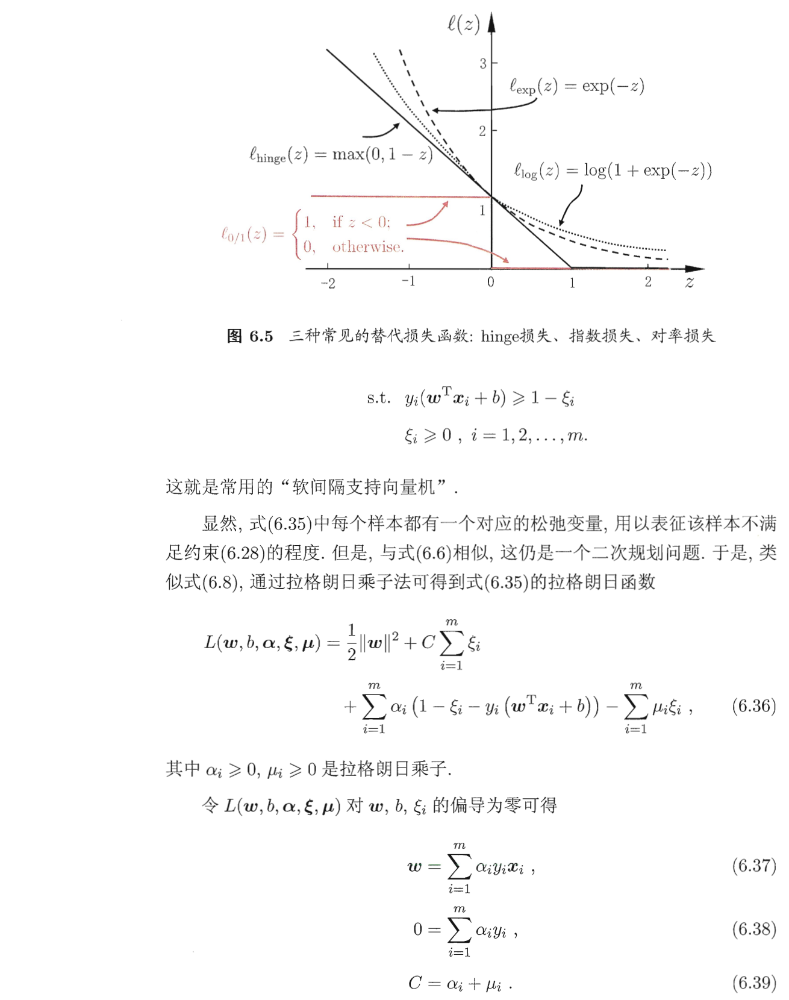 |
|            |                 | **1.支持向量回归** 回归问题：使得f(x)与y近可能接近。传统回归是f(x)与y完全相同时，损失才为0. 于此不同，SVR假设能容忍最多有e的偏差，即当差的绝对值大于e才计算损失。  **2.核方法：**： 不论SVM还是SVR 学得到的模型总是能表示成核函数的线性组合。表示定理；优化问题都可以表示称核函数的线性组合。 | 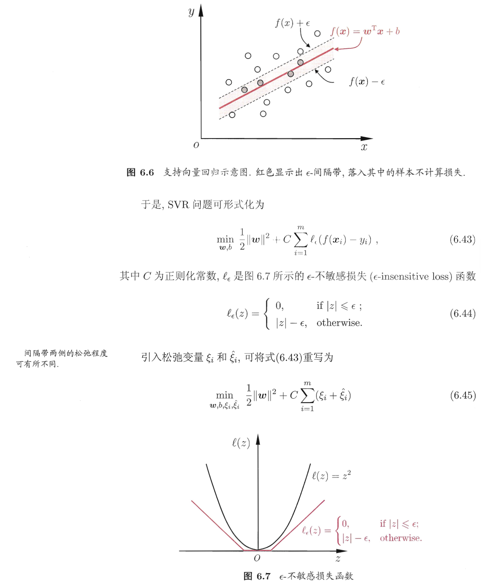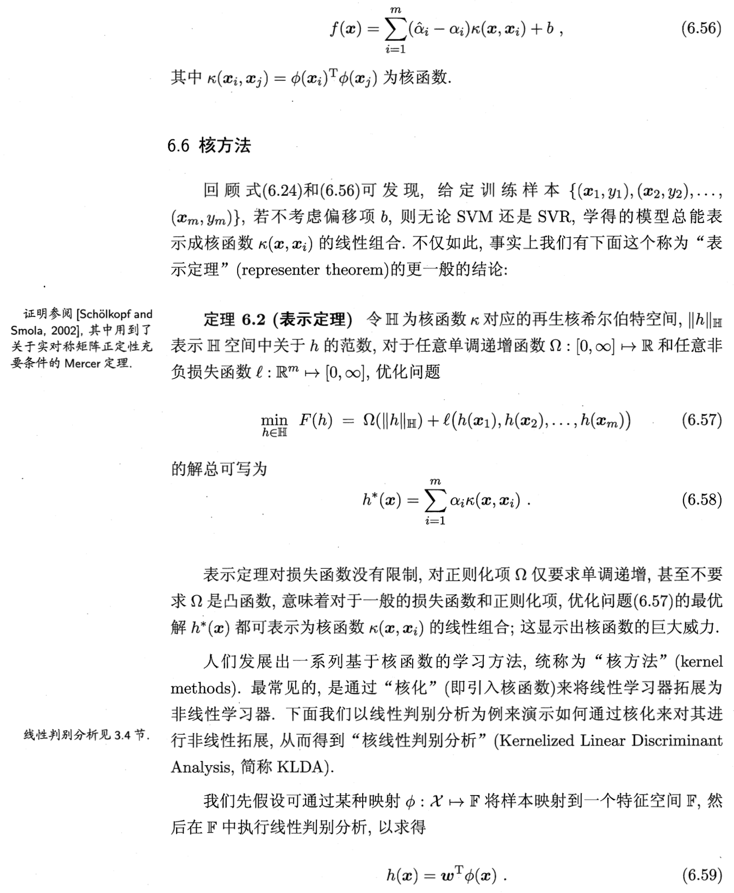 |
|            | **第六章总结**       |                                          | 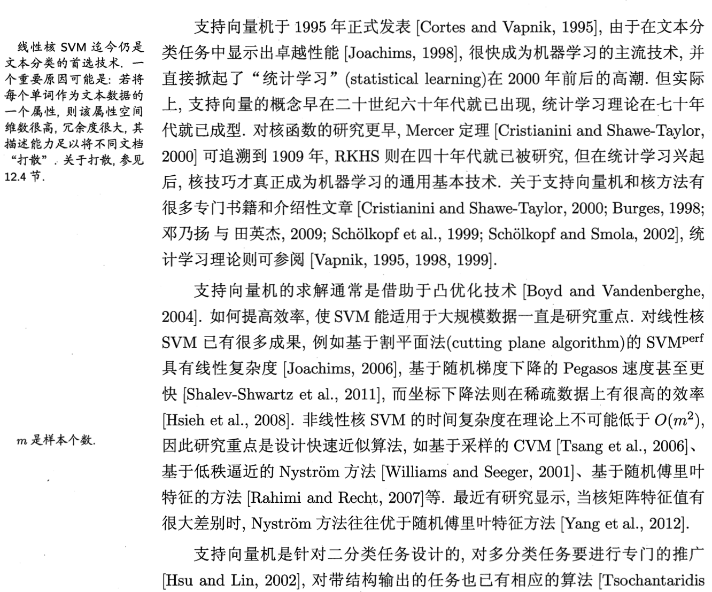 |
|            | **第7章开始：贝叶斯分类** |                                          |                                          |
|            |                 | **1.贝叶斯决策：** 概率框架下实施决策的基本方法，对分类任务来说，在所有相关概率都已知的理想情况下，贝叶斯决策论考虑如何给予这些概率核误判损失来选择最优的类别标记。假设有N种可能的类别标记机遇后验概率获得期望损失。 任务是寻找一个判定准则以最小化总体风险。贝叶斯判定准则：为最小化总体风险，需在每个样本上选择 |                                          |
|            |                 |                                          |                                          |
|            |                 |                                          |                                          |
|            |                 |                                          |                                          |
|            |                 |                                          |                                          |
|            |                 |                                          |                                          |
|            |                 |                                          |                                          |
|            |                 |                                          |                                          |
|            |                 |                                          |                                          |
