注：为个人学习总结需要，如有侵权，请您指出。[持续更新， 如有错误，请您指出]        

> 邮箱：*<u>yangqiokay@foxmai.com</u>*      微信号：<u>*18810578662*</u>

​    

## **「当下唯一一件事：秋招2017」**

------

### A.关于「秋招2017」「技能&专业书」：4／num

### **[4.算法]()** 

| 三次总结&忌盲目乐观 | 二次总结&能讲出来     | 背诵条目&一次总结                                | 参考理解                                     |
| ---------- | ------------- | ---------------------------------------- | ---------------------------------------- |
|            | **绪论开始**      |                                          |                                          |
|            |               | **1.所有的算法都是：**现有API、再有实现、之后是证明，最后是数据。这种先接口后实现、强调测试的做法。**2. 算法和数据结构的学习** 是计算机基础，所有计算机使用者都希望计算机能运行更快一些或能解决更大规模的问题。先要熟悉栈、队列等低级抽象的数据类型，然后研究排序、搜索、图、字符串方面的基础算法。**3.源代码** |                          |
|            | **第一章基础**     |                                          |                                          |
|            |               | **1.目的：**研究多种重要算法，即适合用计算机实现的解决问题的方法。和算法关系密切的是数据结构，即算法操作的组织数据的方法。 **2.算法：**编写计算机程序一般都是实现一种已有的方法来解决某个问题，描述了解决问题的步骤。 算法是计算机科学的基础及核心。 是一种有限、确定有效的适合用计算机程序实现的方法。 **3. 定义一个算法**，可用自然语言描述某个问题过程或一段程序来实现这个过程。如欧几里得算法：找到两个数的最大公约数。**4.算法都需要适当的组织数据：** 为了组织数据产生了数据结构，数据结构式计算机科学研究的核心对象，和算法的关系密切。数据结构式算法的结果或副产品。因此理解算法必须学习数据结构。**5.学习算法主要原因：**能节约非常多的资源。 | 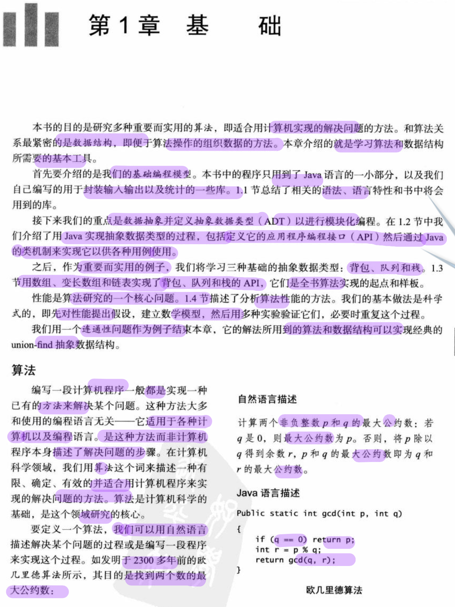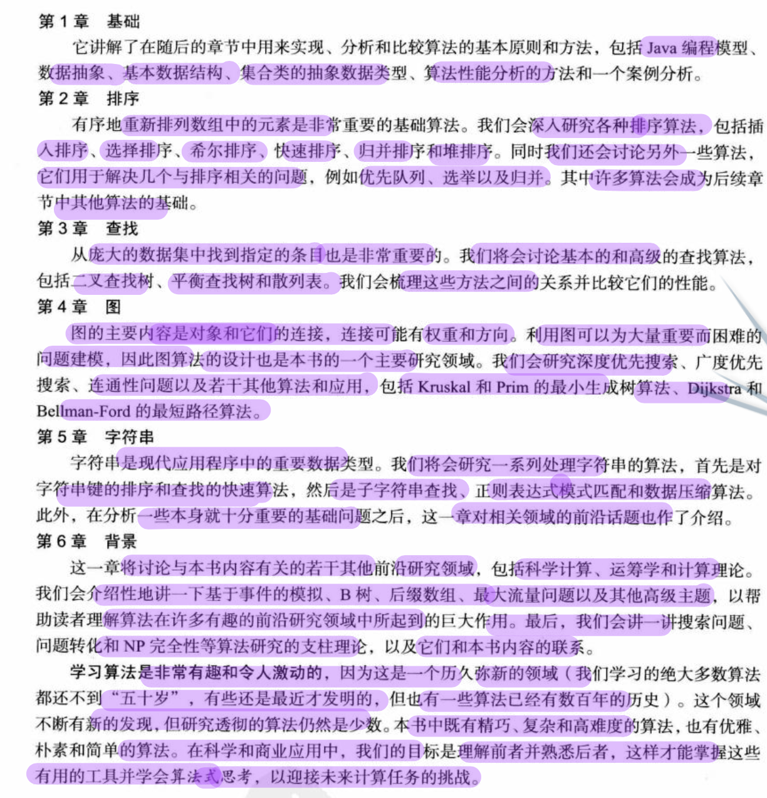 |
|            |               | **1.1基础编程模型** ： Java：程序是对算法精确、优雅、完全的描述， 可通过程序学习算法的各种性质，可在应用程序中直接使用算法。 **2.Java程序的基本结构** 一段java程序（类）或者是一个静态方法（函数）库，或者定义了一个数据类型。 要创建静态方法库和定义数据类型，会用到下面5种语法，是Java语言的基础，也是大多数语言共有的。 **2.1原始数据类型** 在计算机程序中精确的定义整型、浮点数、布尔值等。定义包括取值范围和能够对相应的值进行的操作。能够被组合为类似于数学公式定义的表达式。**2.2语句** 通过创建变量并对其赋值、控制流程或引发副作用来计算。使用6种语句：声明、赋值、条件、循环、调用、返回。 **2.3数组** 多个同种数据类型的值的集合。 **2.4静态方法** 可以封装并重用代码，是我们可以用独立的模块开发程序。**2.5字符串：**一连串的字符，Java内置了一些操作。**2.6 标准输入、输出：** 是程序于外界联系的桥梁 **2.7 数据抽象** 数据抽象封装和重用代码，是我们可定义非原始数据类型，进而支持面向对象编程。 **例子**： BinarySearch类中有两个静态方法rank()和main() 第一个方法有两条声明语句、一条循环语句，一条返回语句。 第二个方法main包含三条语句：一条声明语句、一条调用语句、一个循环语句 **3. 原始数据类型与表达式** 数据类型就是一组数据和对其能进行的操作的集合。 Java基本原始数据类型：整型及其算术运算符int、浮点型及其算法运算符double、布尔型的值true、false及逻辑操作boolean、字符型的值时你能够输入的英文字母数字字符和符号char。java程序控制的是用标识符命名的变量。每个变量都有自己的类型并存储了一个合法的值。表达式的目的就是计算某种数据类型的值。**3.1表达式** 优先级运算符 **3.2类型转换**  数值自动提升为高级的数据类型。转换时指在表达式中把类型名放在括号里将其后的值转换为括号中的类型。如(int)3.7 是3.注意：将浮点型转化为整型会截断小数部分而非四舍五入。尽量小心并少用类型转换。**3.3比较** 比较相同数据类型的两个值，并产生一个布尔值。这些运算符被称为混合类型运算符，因为结果是布尔型，不是参与比较的数据类型。结果是布尔型的表达式被称为布尔表达式。这种表达式是条件语句和循环语句的重要组成部分。 **3.4其他原始类型** Java的整型能表示2^32个不同的值，用一个32位二进制即可表示，虽然计算机是64位二进制，但整型还是32位。于此相似，浮点型的标准规定是64位。Java提供了其他5种原始数据类型：64位整数集算术运算符long、16位整数及蒜素运算符short、16位字符及算术运算符char、8位整数及算术运算符byte、32位单精度实数及算术运算符float。 在本书多用int、double进行 算术运算。 | 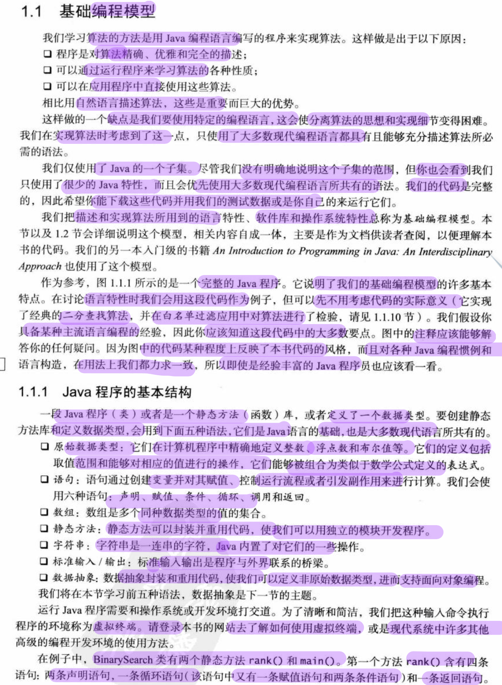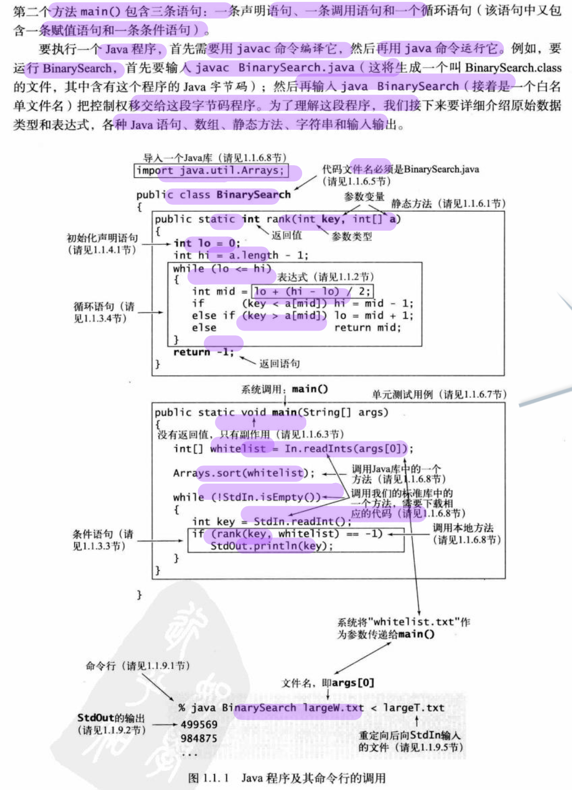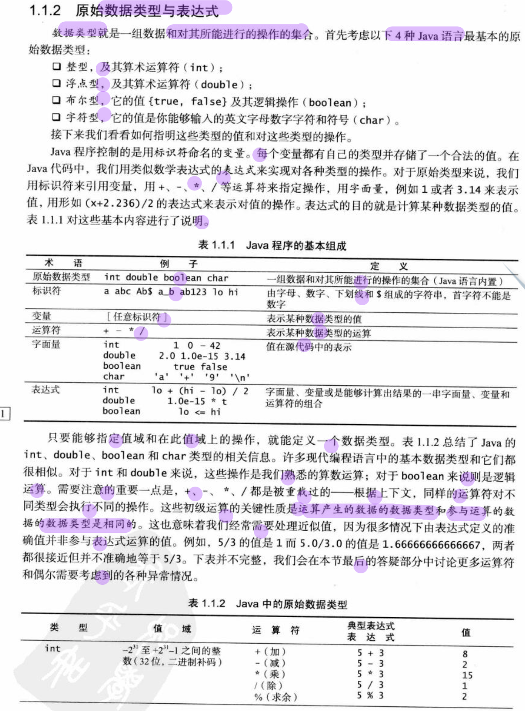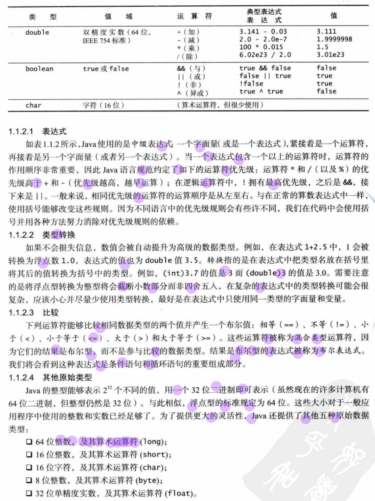 |
|            |               | **1.语句** Java程序是语句组成的。语句能通过创建和操作变量、对变量赋值并控制这些操作的执行流程来描述运算。 语句通常被组织成代码段，及花括号中的一系列语句。 声明语句：创建某种类型的变量并用标识符进行命名。赋值语句：将由表达式产生的某种类型的数值赋值一个变量。Java还有隐式赋值的语法可以使某个变量的值相对于当前值发生变化。例如将整型值加1。条件语句：简单改变执行流程-根据指定条件执行两个代码段之一。循环语句：更彻底改变执行流程-只要条件为真就不断的反复执行代码段中的语句。调用和返回语句：和静态方法有关，是改变执行流程和代码组织的另一种方法。  **程序**就是一系列声明、赋值、条件、循环、调用、返回语句组成的。 一般来说代码的结构都是嵌套的：一个条件语句或循环语句的代码段中也能包含条件语句或是循环语句。例如：rank（）中while循环就包含一个if语句。 **2.声明语句** 将一个变量名和一个类型在编译时关联起来。Java需要我们使用声明语句指定变量的名称和类型。这样就清楚的指明了能够对其进行的操作。Java是强类型的语言。因为Java编译器会检查类型的一致性，比如不允许布尔类型和浮点类型相乘。 **3.赋值语句** 将某个数据类型的值和一个变量关联起来。 在Java中c = a+b。不是数学等式，而是操作，将变量c的值等于变量a的值和变量b的值之和。  语句的目的是改变c的值。赋值语句的左侧必须是单个变量，右侧是能够得到的相应类型值的任意表达式。  **4.条件语句** 大多数运算都需要不同的操作来处理输入。 在Java中用ifelse语句能在两个代码中进行选择。 **5.循环语句** 许多运算需要重复，while。只要布尔表达式的值为真，就继续执行代码段。将循环语句中的代码段称为循环体。 **6.break和contine** 需要比基本的if、while语句更加负责的流程控制。 Java支持在while循环中使用另外两条语句：break：立刻从循环中退出。contine：立刻开始下一轮循环。 |  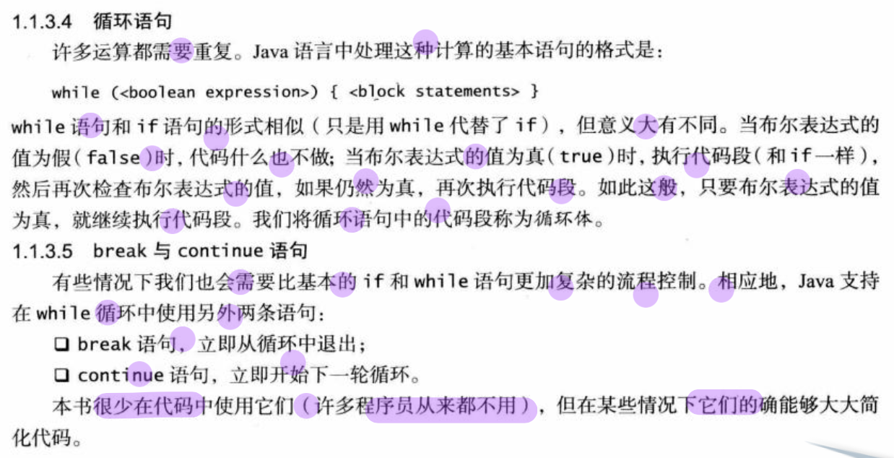    |
|            |               | **1.简便记法：**  **1.1声明并初始化**：int i = 1. 创建名为i的变量并赋予其初始值为1. 最好在接近首次使用变量的地方声明它并将其初始化。 **1.2 隐式赋值：**当希望变量的值相对当前值变化，可使用简便写法。 递增++i, - -i。 i++ ,i - - 其他符合运算符：在赋值语句中将二元运算符写在等号之前，等价于将左边的变量放在等号右边并作为第一个操作符例如：i/=2。等价于i=i/2。  **1.3 单语句代码段：**如果条件或循环语句的代码段只有一条语句。代码段的花括号可以省略。 **1.4 for语句：**很多循环模型：初始化一个索引变量，然后用while循环并将包含索引变量的表达式作为循环的条件。 while循环的最后一条语句会讲索引变量加1。 | 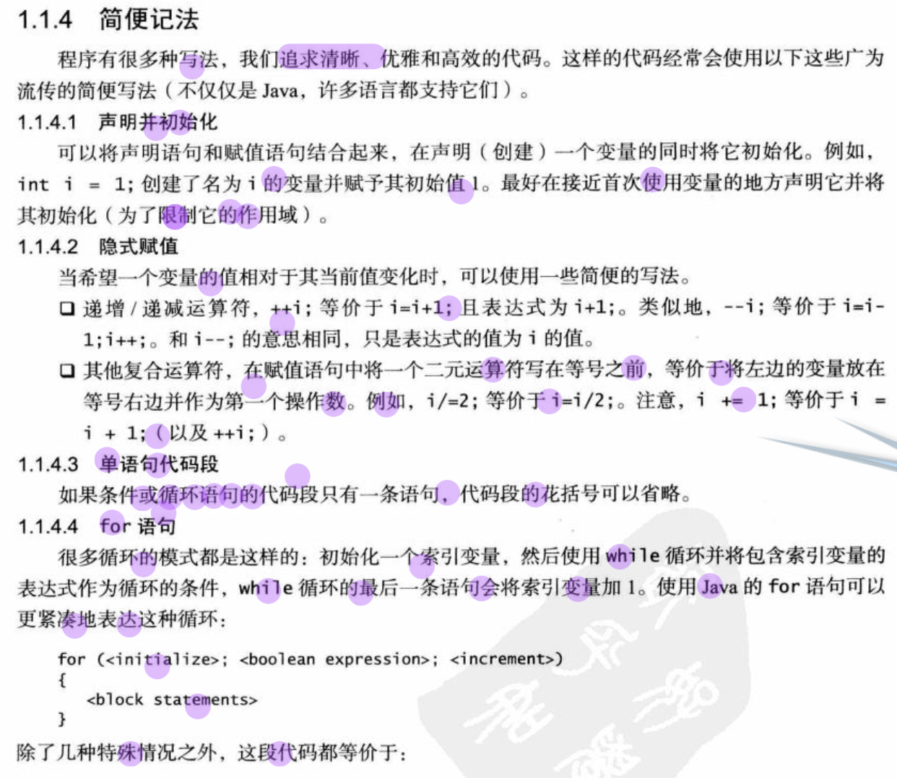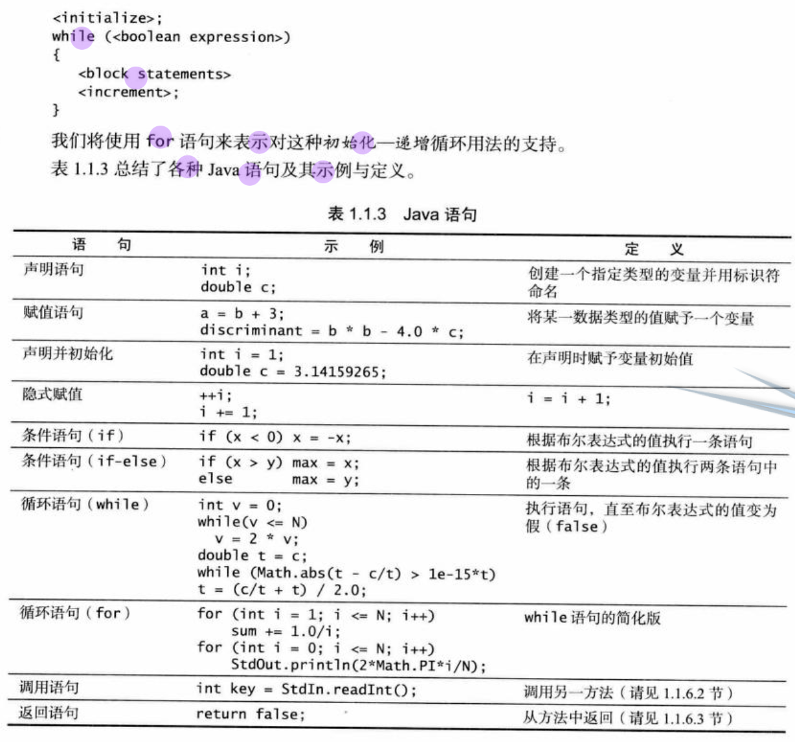     |
|            |               | **1.数组：**数组能顺序存储相同类型的多个数据。 除了存储数据，也能访问数据。 访问数据中的某个元素的方法是将其编号然后索引。如果有N个值。编号为0-N-1。 对0-N-1之间任意的i。我们就能在Java中用a\[i]唯一表示第i个元素的值。 在Java中这种数组被称为一维数组。  **2.创建并初始化数组。** 在Java中创建一个数组需要三步：声明数组的名字和类型。 创建数组。初始化数组元素。声明数组时，需要指定数组的名称和它含有的数据的类型。 在创建数组时，需要指定数组的长度如元素的个数。 new创建一个数组。所有元素的初始值都是0。在代码中使用数组时，一定依次声明、创建、初始化数组。  **3.简化写法** 利用Java讲对数组的三步骤合为一条语句。 左侧声明了数组。 右侧创建了数组。 默认初始值都是0.0。 如果要使用不同的初始值。那么就需要用for循环了。 数值类型默认初始值为0。布尔类型默认初始值时false. 第三种方法用花括号将一系列由逗号分隔的值在编译的时候将数组初始化。 **4.使用数组** 典型的数组处理代码如表。在声明并创建数组之后，在代码的任何地方都能通过数组名之后的方括号中的索引来访问其中的元素。 数组一经创建。大小就是固定的。程度能通过a.length获取a\[]的长度。 也的得到最后一个元素a\[a.length-1] 。Java会自动进行边界检查，如果创建了一个大小为N的数组。但使用了一个小于0或者大于N-1的索引访问，会抛出ArrayOutOfBoundsException异常而终止。 **5.起别名：** 数组名表示的是整个数组-如果我们将一个数组变量赋于另一个变量，那么两个变量将会指向同一个数组。如果想将数组复制一份，应该声明、创建并初始化一个新的数组，然后将原数组中的元素值挨个复制到新数组。 **6.二维数组** Java中二维数组就是一位数组的数组。 二维数组可以是参差不齐的。 大多数情况下MxN。即M行长度为N的数组的二维数组。 在Java中访问二维数组也简单。 a的第i行第j类元素。 声明二位数组需要两对方括号。 创建二维数组时要在类型名之后分别在方括号中指定行数及列数。约定第一行是行数、第二行识列数。 和一维数组一样。Java会将数值类型的数组元素初始化为0. 将布尔类型的元素初始化为false。 默认的初始化对二维数组更有用。因为可以节约更多的代码。 将二维数组初始化为0时，这段代码事多余的。 但是如果想要初始化为其他值。 我们就需要嵌套的for循环。 | 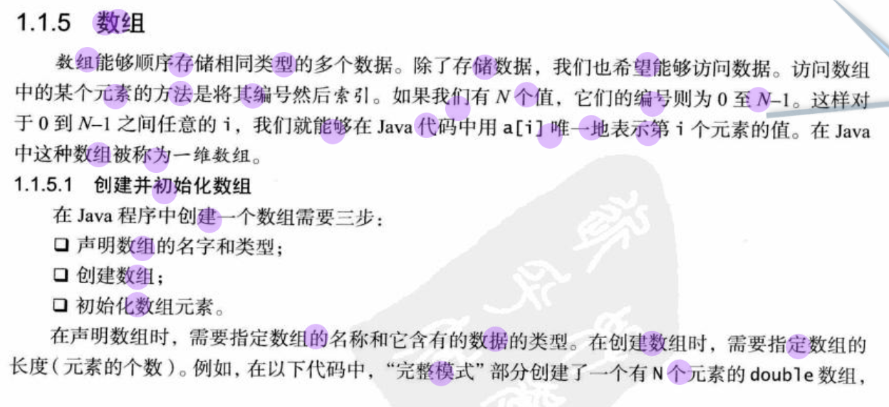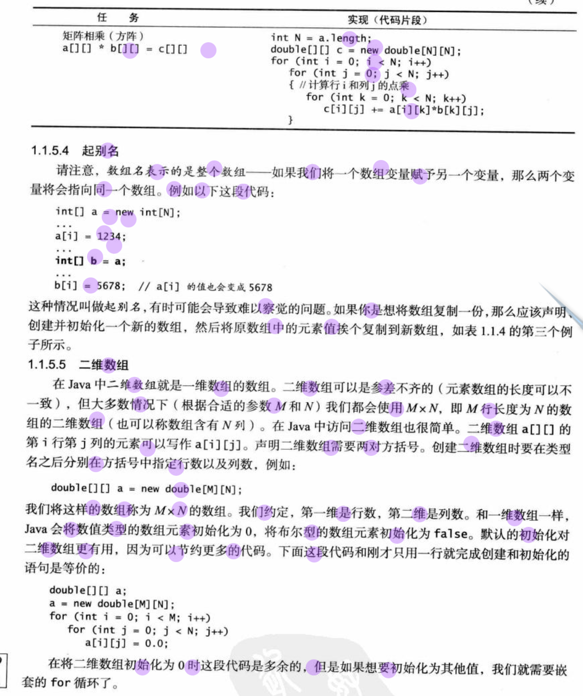 |
|            |               | **1.静态方法**  本书中Java程序要么是数据类型的定义，要么是一个静态方法库。 静态方法被称为函数。 因为和数学函数性质类似。静态方法是一组在被调用时会被顺序执行的语句。 修饰符static将这类方法和实例方法区分开。 **2.静态方法** ：方法封装了一系列语句所描述的运算。 方法需要参数(某种数据类型的值)并分局参数计算某种数据类型的返回值(例如数学函数的结果)或产生某种副作用(比如打印出一个值). BinarySearch中静态函数rank是前一个例子。main是后一个例子。 每个静态方法都是由签名(关键字public static 及函数的返回值，方法名及一串各种类型的参数) 和函数体(包含在花括号中的代码)组成的。 **3.调用静态方法** 调用静态方法的方法是写出方法名，并在后面的括号中列出参数值，用逗号分隔。 当调用是表达式的一部分时，方法的返回值将会代替表达式中的方法调用。 例如rank()返回了一个int值。 **4. 方法的性质** **方法的参数按值传递：**在方法中参数的使用方法和局部变量相同， 唯一不同的是参数变量的初始化是由调用方提供的。方法处理的是参数的值，不是参数本身。例如sort能够改变参数传递的数组的内容，将其排序。 **方法名可以重载**，重载的另一种常见用法是为函数定义两个版本。其中一个需要一个参数而另一个则为该参数提供一个默认值。 **方法只能返回一个值，但可以包含多个返回语句**。 一个Java方法只能返回一个值，类型是方法签名中声明的类型。静态方法第一次执行到一条返回语句时控制权将会回到调用代码中。 **方法可以产生副作用**。方法的返回值可以是void， 表明该方法没有返回值。返回值为void的静态函数不需要明确的返回语句，方法的最后一条语句执行完毕后控制权将会返回给调用方。我们称void类型的静态方法会产生副作用(接受输入、产生输出、修改数组或者改变系统状态)。 例如main的返回值就是vois。因为副作用是向外出书。 技术上说，数学方法的返回值都不会是void。  **5.递归** ：方法可以调用自己。 经常使用递归，因为递归代码比相应的非递归代码更佳简洁优雅、易懂。 用数学归纳法证明算法的正确性。 编写递归代码时最重要的有以下三点： 递归总有一个最简单的情况-方法的第一条语句总是一个包含return的条件语句。 递归总是去尝试解决一个规模更小的子问题。，这样递归才能收敛到最简单的情况。递归调用的父问题和尝试解决的子问题之间不应该有交集。 **6. 基础编程模型** 静态方法库是定义在一个Java类中的一组静态方法。 存放类的文件的文件名和类型相同。 Java开发的基本模式是编写一个静态方法库来完成一个任务。输入Java和类名以及一系列字符串就能调用类中的main方法。 参数为由输入的字符串组成的数组。main的最后一条语句执行完毕之后程序终止。  **7.模块化编程** 这个模型的最重要之处在于通过静态方法库实现了模块法编程。 我们可以构造许多个静态方法库(模块), 一个库中的静态方法也能够调用另一个库中定义的静态方法。 好处：程序整体代码量很大，每次处理的模块大小适中。可以共享和重用代码而无需重新实现。 很容易用改进的实现替换老的实现。 可以为解决编程问题建立合适的抽象模型。 缩小调试范围。 **8. 单元测试**  Java编程的最佳实践之一就是每个静态方法库中都包含一个main函数来测试苦衷的所有方法。 恰当的单元测试很有挑战。 每个模块的main方法至少应该调用模块中的其他代码并在某种程度上保证它的正确性。随着模块的成熟，可以将mian作为开发用例。**9.外部库** 使用来自4个不同类型的库中的静态方法， 重用每种库代码的方式都不同，大多都是静态方法库，也有部分是数据类型的定义并包含静态方法。 **系统标准库java.lang.\***：包含Math库，实现了常用的数学函数Integer和Double库。能够将字符串转为int和double值。 String和StringBuilder库。**导入的系统库**：如java.utils.Arrays。 每个标准的Java版本中包含上千个这种类型的库。 需要import导入才能使用这些库。要调用另一个库中的方法，需要在方法前指定库的名称。 | 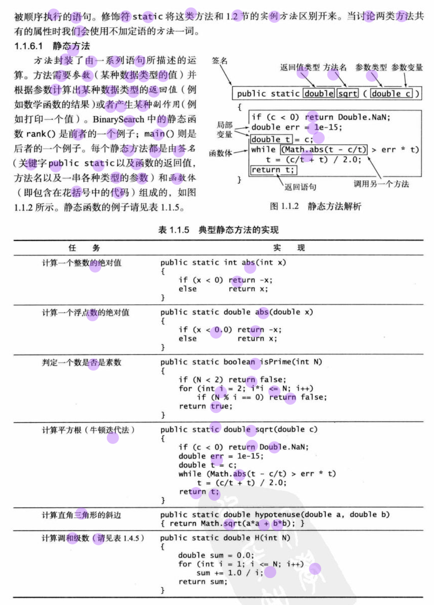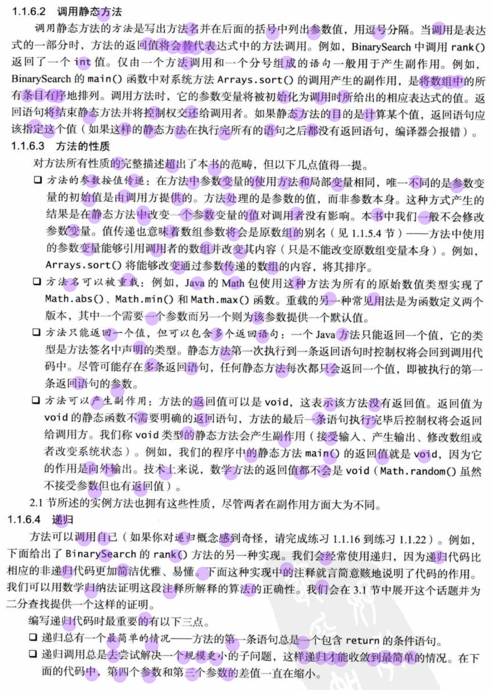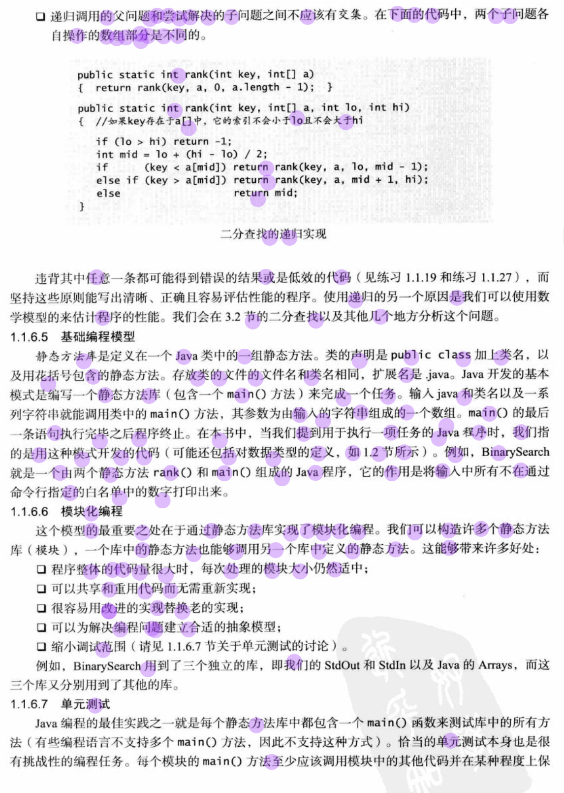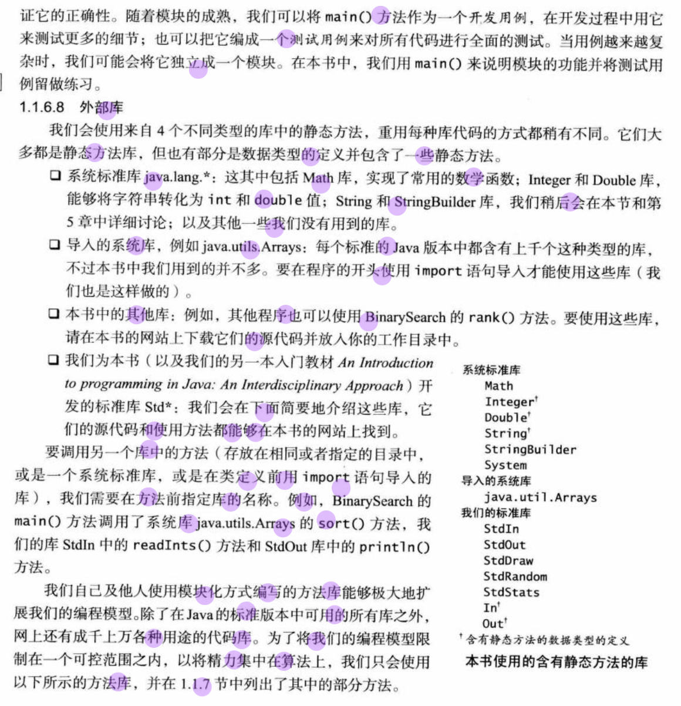 |
|            |               | **1.API** ：模块化编程的一个重要组成部分就是记录库方法的用法并供他人参考的文档。统一使用应用程序编程接口API的方式列出本书中每个库方法名称、签名和简短的描述。 用用例来指代调用另一个库中的方法的程序，用实现描述实现了某个API方法的Java代码。 **2.举例** 用java.lang中Math库常用的静态方法说明API文档格式。 参数都是double类型，返回值也是double类型。API每一行描述了一个方法，提供了使用该方法所需要知道的所有信息。**3.Java库**：成千上万个库。 Arrays库不在java.lang中， 需要用import语句导入后才能使用。**4.自己编写库** API目的是将调用和实现分离。除了API中给出的信息，调用者不需要知道实现的其他细节。API使我们能广泛的重用那些为各种目的独立开发的代码。没有任何一个Java库能包含所有方法，因此对于编写复杂应用程序特别重要。相应的。程序员也可以将API看中调用和实现的契约。详细说明了每个方法的作用。 | 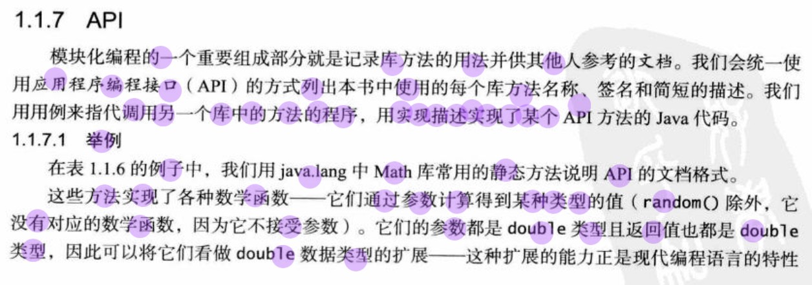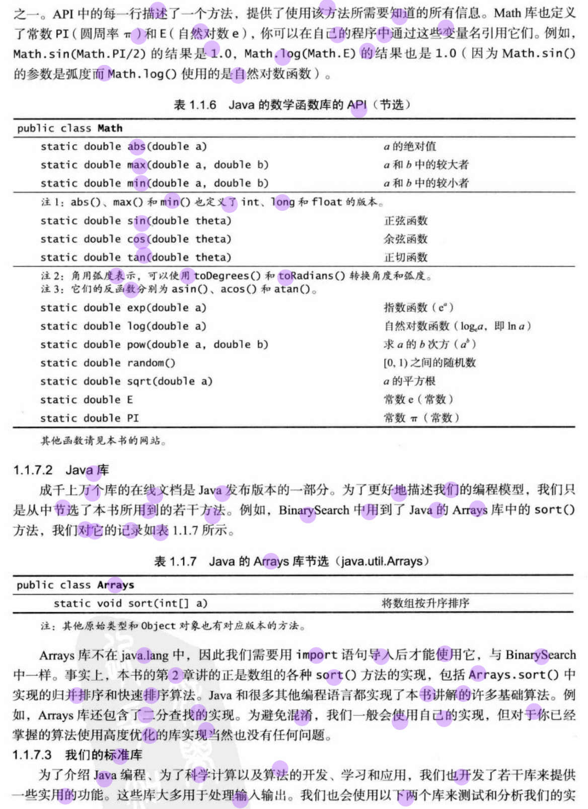 |
|            |               | **1.字符串：**一串字符char类型的值组成。 一个String类型的字面量包括一对双引号和其中的字符。比如"hello,world"。 String类型是Java的一个数据类型，并不是原始数据类型。非常基础。 **2.字符串拼接** Java内置了一个串联Sting类型字符串的运算符“+”。**3.类型转换** 字符串的两个主要用途分别是将用户从键盘输入的内容转换成相应数据类型的值以及将各种数据类型的值转化为能在屏幕上显示的内容。 Java的String类型为这些操作内置了相应的方法。热而且Integer额Double库还包含了分别和String类型相互转化的静态方法。**4.自动转换** 很少使用toString()方法。因为Java在连接字符串的时候会自动将任意数据类型的值转化为字符串。 如果加号+的一个参数是字符串，则java会自动将其他参数都转化为字符串。可能通过一个空字符串“” 将任意数据类型的值转为字符串的值。 **5.命令行参数** 在Java中字符串的一个重要用途就是使程序能够接收到从命令行传递来的信息。系统会调用main方法将一系列字符串变为数组作为参数传递。 |      |
|            |               | **1.输入输出** 标准输入、输出、绘图库的作用是建立一个Java程序和外界交流的简易模型。 这些库的基础是强大的java标准库。 在模型中java程序可以从该命令行参数货一个名为标准输入流的抽象字符流中获得输入，并将输出写入另一个名为标准输出流的字符流中。**2.命令和参数** java 类包含一个静态方法main。有一个string数组类型的参数args\[]。 这个数组的内容就是我们输入的命令行参数。操作系统会将它传递给java。 java和操作系统默认参数为字符串。 如果需要参数是数字，用类似Integer.parseInt()的方法将体转化为适当的数据类型的值。 **3.标准输出** 一般来说，系统会将标准输出打印到终端窗口。print()方法会将它的参数放到标准输出中。println()会附加换行。 Printf()可以格式化输出。 **4.格式化输出** printf()方法接受两个参数。第一个参数是格式字符串。 描述了第二个参数应该如何在输出中被转化为一个字符穿。最简单：%并紧跟一个字符表示的转换代码。 d十进制数、f浮点数、s字符串。 在%和转化代码之间可用整数表示转换后值的宽度即字符串的长度。在printf()中需要明确的在第一个参数的末尾加上换行。 可以以用String.format()来用和prinf()相同的参数得到一个格式化字符串。 **5.标准输入** 标准输入流最重要的特点是这些值会在你的程序读取之后消失。只要程序读取了一个值。就不能回退并再次读取他。 **6.重定向与管道** 标准输入输出能利用操作系统支持命令行的扩展功能。 将标准输出重定向至一个文件。文件内容可以保存，也可以作为另一个程序的输入： %java RandomSeq 1000 > data.txt。 这条命令指明标准输出流不是被打印至终端窗口，而是被写入一个叫做data.txt的文件。得到一个含有1000个随机数的文件。 %java Average < data.txt 会从文件中读取一系列数值并计算平均值。 <是一个提示符 ，告诉操作系统读取文本文件data.txt 作为输入流而不是等待用户输入。  % java RandomSeq 1000 \| java Average 将Random的标准输出和Average的标准输入指定为统一流。 **7基于文件的输入输出** 实现向文件中写入货从文件中官渡区一个原始数据类型。**8.标准绘图库** 产生图像输出的抽象层。 允许我们利用可视化方式处理比文字丰富得多的信息。**stdDraw** | 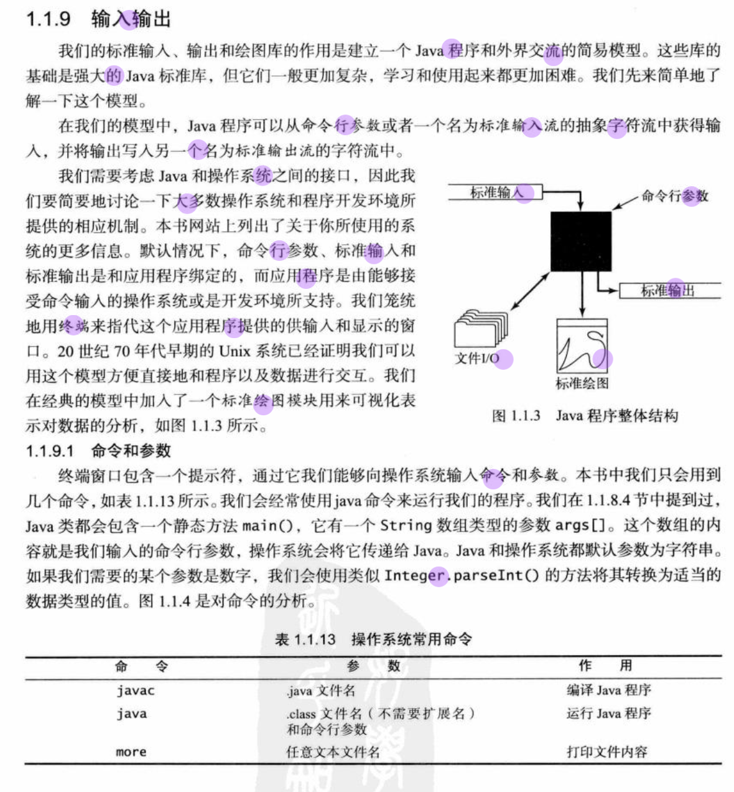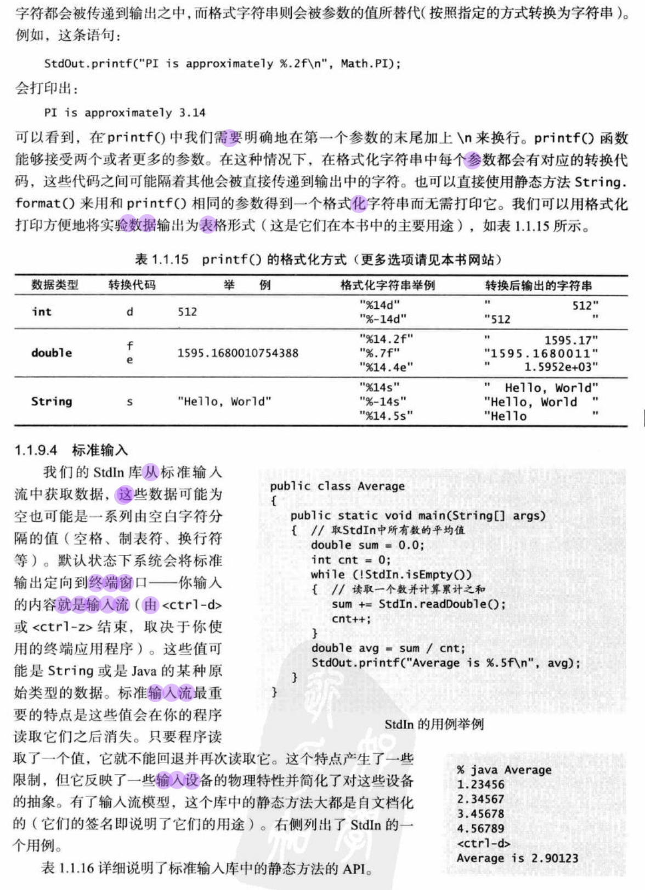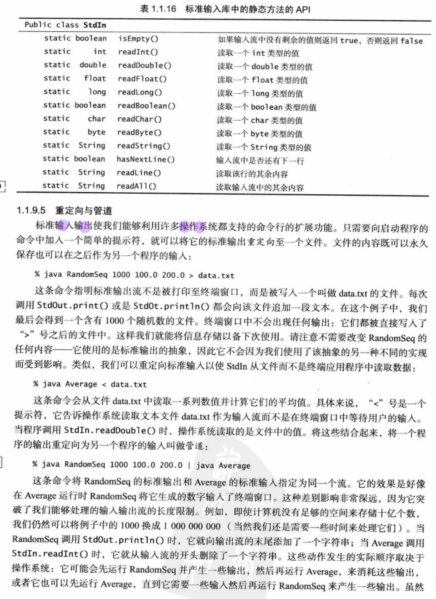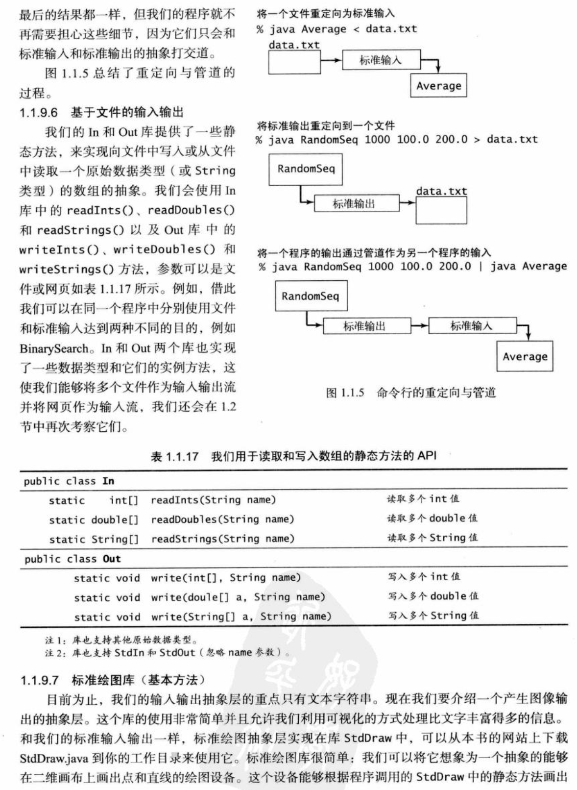 |
|            |               | **1.二分查找** 高校、应用广泛的二分查找算法。 **2.二分查找** 算法由静态方法rank实现。 接受一个整数键和一个有序的int数组作为参数。 **3.白名单过滤** 测试用例都会通过模拟实际情况来展示当前算法的必要性。 称为白名单过滤。**4.性能** 编程模型的目的：确保你能够在计算机运行类似BinarySearch的代码。 使用它处理我们的测试数据并为适应各种情况修改他。 | 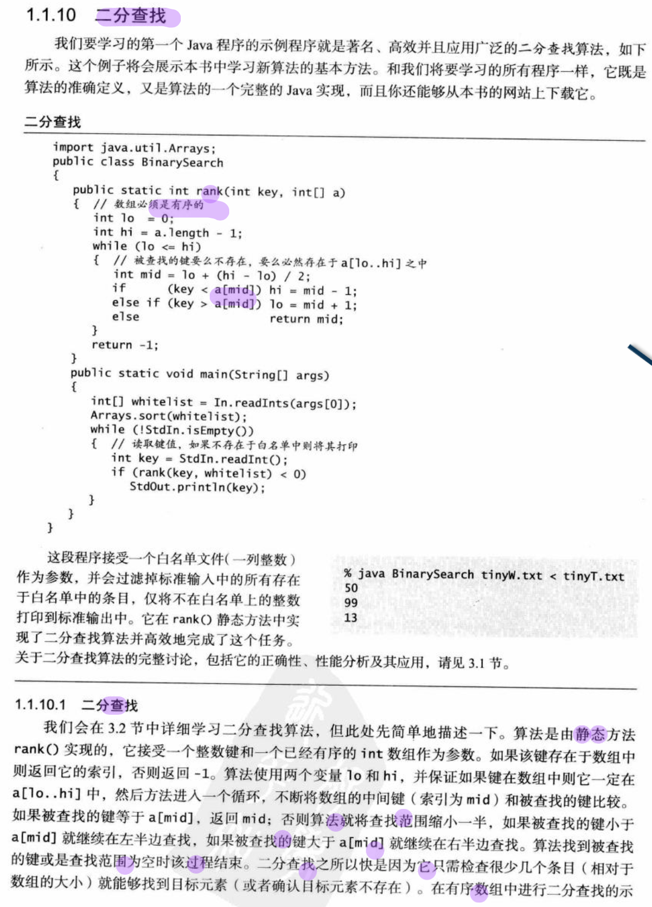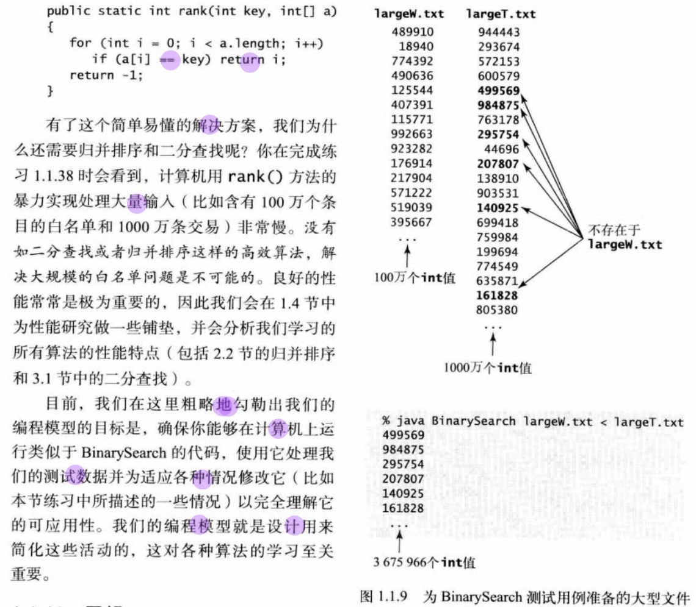 |
|            | **第一章的1.1总结** | 数据抽象，也叫面向对象。 数据抽象的主要思想是鼓励程序自定义自己的数据类型：一系列值和对这些值的操作，而不仅仅是那些操作预定义的数据类型的静态方法。 面向对象的主原因有三：**允许通过模块化编程复用代码**，包括调用自定义的数据类型。**轻易构造链式数据结构**，比数组更灵活。可以准确定义多面对的算法问题。  Java字节码、Java允许整型溢出 | 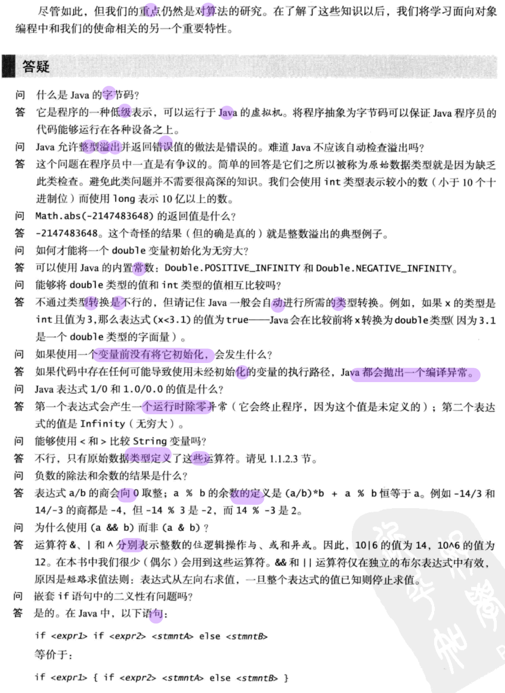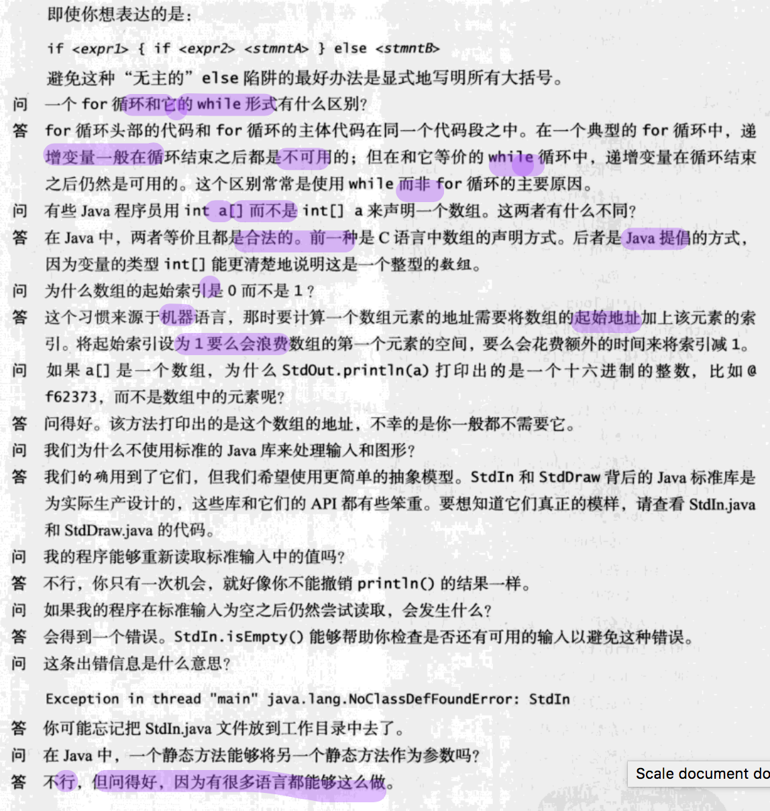 |